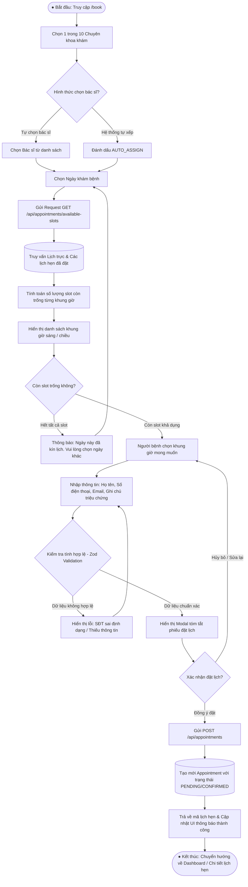
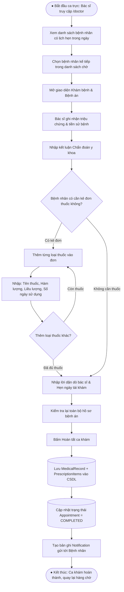
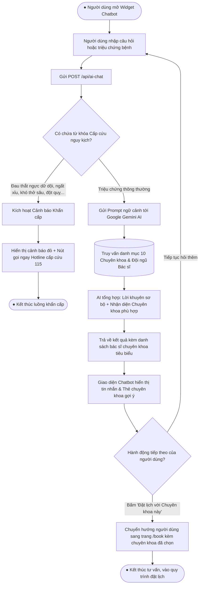
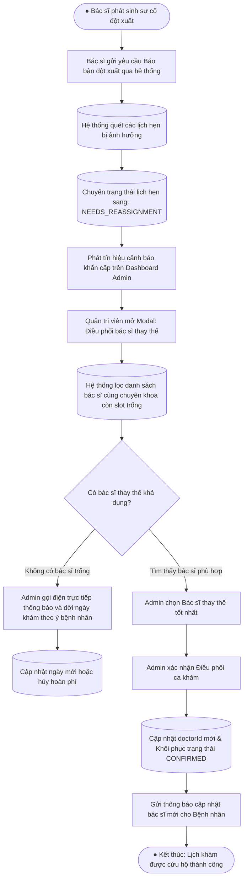
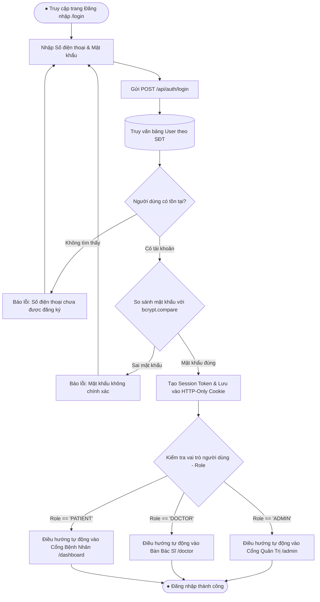

# 📊 TÀI LIỆU THIẾT KẾ SƠ ĐỒ HOẠT ĐỘNG (ACTIVITY DIAGRAM SPECIFICATION)
## DỰ ÁN: HỆ THỐNG QUẢN LÝ & ĐẶT LỊCH PHÒNG KHÁM ĐA KHOA CAREPLUS 2026

---

## 📌 TỔNG QUAN VỀ SƠ ĐỒ HOẠT ĐỘNG TRONG ĐỒ ÁN
Sơ đồ hoạt động (Activity Diagram) trong UML mô tả các luồng nghiệp vụ (Business Workflows) động của hệ thống, bao gồm các bước tuần tự, các điểm rẽ nhánh điều kiện (Decision Points), các luồng song song (Fork/Join) và các bên tham gia thông qua kỹ thuật **Phân làn trách nhiệm (Swimlanes / Partitions)**.

Trong đồ án phòng khám CarePlus 2026, có **5 quy trình nghiệp vụ cốt lõi** cần được mô hình hóa:
1. **Quy trình 1**: Đặt lịch khám bệnh trực tuyến & Tính toán slot trống (Core Booking Engine).
2. **Quy trình 2**: Bác sĩ tiến hành khám bệnh & Kê đơn thuốc điện tử (Clinical Consultation).
3. **Quy trình 3**: Trợ lý ảo AI Chatbot tư vấn triệu chứng & Phân luồng chuyên khoa (AI Triage).
4. **Quy trình 4**: Báo bận đột xuất & Điều phối lại bác sĩ khám (Urgent Reassignment).
5. **Quy trình 5**: Đăng ký, Đăng nhập & Phân quyền truy cập (Authentication & RBAC).

---

## 1. SƠ ĐỒ HOẠT ĐỘNG 1: ĐẶT LỊCH KHÁM BỆNH TRỰC TUYẾN
> **Mục tiêu**: Thể hiện toàn bộ quy trình người bệnh lựa chọn dịch vụ, hệ thống kiểm tra tình trạng slot giờ trống trong CSDL và phát hành phiếu hẹn.

### 💡 Quy tắc nghiệp vụ (Business Rules) áp dụng:
* **Khóa ngày quá khứ**: Không cho phép chọn ngày nhỏ hơn ngày hiện tại (`appointmentDate >= today`).
* **Tính toán slot trống**: Mỗi ca khám có thời lượng quy chuẩn (ví dụ: 30 phút/slot). Slot đã có lịch hẹn được xác nhận sẽ bị vô hiệu hóa (disabled).
* **Auto-assign engine**: Nếu chọn `AUTO_ASSIGN`, hệ thống tự động tìm bác sĩ thuộc chuyên khoa có ít lịch hẹn nhất trong khung giờ đó để cân bằng tải.

---

## 2. SƠ ĐỒ HOẠT ĐỘNG 2: BÁC SĨ KHÁM BỆNH & KÊ ĐƠN THUỐC ĐIỆN TỬ
> **Mục tiêu**: Thể hiện quy trình làm việc chuẩn y khoa tại bàn khám bệnh (`/doctor`) của Bác sĩ.

---

## 3. SƠ ĐỒ HOẠT ĐỘNG 3: TRỢ LÝ ẢO AI CHATBOT TƯ VẤN TRIỆU CHỨNG Y TẾ
> **Mục tiêu**: Thể hiện luồng tương tác thông minh giữa người bệnh và AI CareBot, tích hợp cảnh báo cấp cứu và gợi ý chuyển luồng khám.

---

## 4. SƠ ĐỒ HOẠT ĐỘNG 4: XỬ LÝ BIẾN ĐỘNG CA TRỰC & ĐIỀU PHỐI LẠI BÁC SĨ (REASSIGNMENT)
> **Mục tiêu**: Thể hiện tính năng phục hồi ca trực và bảo toàn lịch hẹn của bệnh nhân khi bác sĩ gặp trường hợp bất khả kháng.

---

## 5. SƠ ĐỒ HOẠT ĐỘNG 5: ĐĂNG NHẬP, ĐĂNG KÝ & PHÂN QUYỀN TRUY CẬP (RBAC)
> **Mục tiêu**: Thể hiện cơ chế bảo mật xác thực danh tính và điều hướng người dùng theo vai trò (`ADMIN`, `DOCTOR`, `PATIENT`).

---

## 6. HƯỚNG DẪN ĐƯA VÀO BÁO CÁO ĐỒ ÁN
* **Vị trí đề xuất trong Báo cáo**:
  * Đặt tại **Chương 4: Thiết kế chi tiết hệ thống** (Detailed System Design) hoặc **Mục 3.3: Thiết kế các quy trình nghiệp vụ**.
* **Cách xuất ảnh**:
  * Copy từng khối mã `mermaid` ở trên vào [Mermaid Live Editor](https://mermaid.live) hoặc [Draw.io](https://app.diagrams.net) để xuất định dạng PNG/SVG chất lượng cao (300 DPI) chèn vào Microsoft Word hoặc LaTeX.
