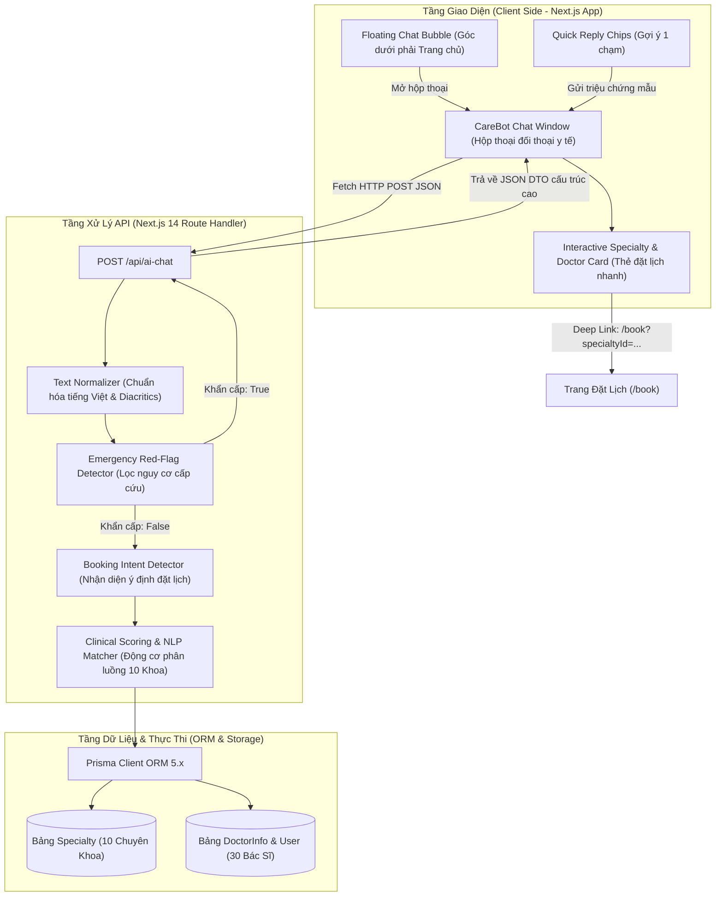
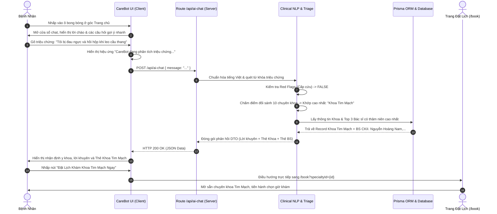
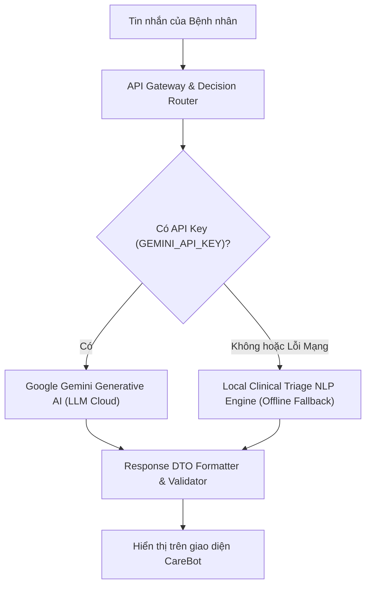

# TÀI LIỆU PHÂN TÍCH TOÀN DIỆN HỆ THỐNG AI CHATBOT TƯ VẤN Y TẾ & PHÂN LUỒNG KHÁM BỆNH (CAREBOT ARCHITECTURE)
## DỰ ÁN PHÒNG KHÁM ĐA KHOA CAREPLUS+ (CAREPLUS CLINIC 2026)

---

## MỤC LỤC
1. [Giới Thiệu & Bài Toán Nghiệp Vụ Y Tế (Overview & Clinical Problem)](#1-giới-thiệu--bài-toán-nghiệp-vụ-y-tế)
2. [Kiến Trúc Kỹ Thuật Tổng Thể (System Architecture & Pipeline)](#2-kiến-trúc-kỹ-thuật-tổng-thể)
   - [2.1. Sơ đồ khối kiến trúc hệ thống (Block Architecture)](#21-sơ-đồ-khối-kiến-trúc-hệ-thống)
   - [2.2. Sơ đồ tuần tự luồng tương tác (Sequence Diagram)](#22-sơ-đồ-tuần-tự-luồng-tương-tác)
3. [Thuật Toán Xử Lý Ngôn Ngữ Tự Nhiên & Phân Luồng Triệu Chứng (Clinical NLP Engine)](#3-thuật-toán-xử-lý-ngôn-ngữ-tự-nhiên--phân-luồng-triệu-chứng)
   - [3.1. Chuẩn hóa văn bản Tiếng Việt không dấu & lọc nhiễu](#31-chuẩn-hóa-văn-bản-tiếng-việt-không-dấu--lọc-nhiễu)
   - [3.2. Thuật toán chấm điểm ngữ cảnh theo trọng số cụm từ (Context-Aware Scoring)](#32-thuật-toán-chấm-điểm-ngữ-cảnh-theo-trọng-số-cụm-từ)
   - [3.3. Ma trận từ điển triệu chứng cho 10 Chuyên khoa Y tế](#33-ma-trận-từ-điển-triệu-chứng-cho-10-chuyên-khoa-y-tế)
4. [Cơ Chế Phân Loại Khẩn Cấp & Đạo Đức Y Tế (Emergency Red Flags & Medical Ethics)](#4-cơ-chế-phân-loại-khẩn-cấp--đạo-đức-y-tế)
   - [4.1. Bộ lọc cảnh báo khẩn cấp (Emergency Red Flags Triage)](#41-bộ-lọc-cảnh-báo-khẩn-cấp)
   - [4.2. Nguyên tắc đạo đức y tế & Miễn trừ trách nhiệm (Medical Disclaimers)](#42-nguyên-tắc-đạo-đức-y-tế--miễn-trừ-trách-nhiệm)
5. [Tích Hợp Dữ Liệu Thời Gian Thực Với Cơ Sở Dữ Liệu Prisma (Real-time DB Integration)](#5-tích-hợp-dữ-liệu-thời-gian-thực-với-cơ-sở-dữ-liệu-prisma)
6. [Thiết Kế Giao Diện & Trải Nghiệm Người Dùng (Frontend UI/UX & Micro-Interactions)](#6-thiết-kế-giao-diện--trải-nghiệm-người-dùng)
   - [6.1. Bong bóng nổi góc màn hình (Floating Action Bubble)](#61-bong-bóng-nổi-góc-màn-hình)
   - [6.2. Cửa sổ đối thoại y tế (Medical Chat Dialog Window)](#62-cửa-sổ-đối-thoại-y-tế)
   - [6.3. Thẻ hành động chuyên khoa & Bác sĩ tương tác (Actionable Cards & Deep-Links)](#63-thẻ-hành-động-chuyên-khoa--bác-sĩ-tương-tác)
   - [6.4. Nút gợi ý nhanh 1 chạm (Quick Reply Chips)](#64-nút-gợi-ý-nhanh-1-chạm)
7. [Đặc Tả Kỹ Thuật API `/api/ai-chat` (API Specification & Contract)](#7-đặc-tả-kỹ-thuật-api-apiai-chat)
8. [Kiến Trúc Mở Rộng LLM Thế Hệ Mới (Generative AI & LLM Roadmap)](#8-kiến-trúc-mở-rộng-llm-thế-hệ-mới)

---

## 1. GIỚI THIỆU & BÀI TOÁN NGHIỆP VỤ Y TẾ

Trong quy trình khám chữa bệnh tại các phòng khám đa khoa hiện đại, **khâu tiếp đón và phân loại bệnh ban đầu (Triage)** đóng vai trò quyết định đến chất lượng dịch vụ và tính chính xác của việc điều trị. Theo thống kê thực tế:
- Hơn **65% bệnh nhân** không xác định chính xác triệu chứng của mình thuộc chuyên khoa nào (ví dụ: đau ngực do tim mạch hay do trào ngược dạ dày thực quản; đau cổ vai gáy do cơ xương khớp hay do thoái hóa đốt sống cổ).
- Bệnh nhân đăng ký nhầm chuyên khoa dẫn đến việc mất thời gian khám sàng lọc, phải chuyển khoa lòng vòng, gia tăng áp lực lên bàn tiếp đón và đội ngũ điều dưỡng lễ tân.
- Bệnh nhân có nhu cầu được hướng dẫn quy trình đặt hẹn trực tuyến một cách trực quan, nhanh gọn 24/7 mà không cần gọi điện thoại chờ máy.

**CareBot — Trợ lý Bác sĩ Ảo** được tích hợp trực tiếp vào hệ thống phòng khám CarePlus+ 2026 nhằm giải quyết triệt để các thách thức trên:
1. **Tư vấn & Phân tích triệu chứng tức thì**: Tiếp nhận mô tả tự nhiên bằng tiếng Việt từ người bệnh.
2. **Định hướng chuyên khoa chuẩn xác**: Tự động gợi ý 1 trong 10 chuyên khoa phù hợp nhất của phòng khám.
3. **Đề xuất Bác sĩ tiêu biểu**: Hiển thị hồ sơ bác sĩ có chuyên môn cao nhất kèm học vị, số năm kinh nghiệm và mức viện phí công khai.
4. **Điều hướng đặt lịch 1 chạm (Deep Linking)**: Nhúng nút đặt lịch trực tiếp ngay trong thẻ hội thoại, điền sẵn Chuyên khoa và Bác sĩ vào luồng đặt hẹn 3 bước.
5. **Sàng lọc khẩn cấp (Emergency Triage)**: Tự động phát hiện các dấu hiệu nguy kịch để phát tín hiệu báo động đỏ, hướng dẫn gọi cấp cứu 115 hoặc hotline phòng khám.

---

## 2. KIẾN TRÚC KỸ THUẬT TỔNG THỂ

### 2.1. Sơ đồ khối kiến trúc hệ thống



### 2.2. Sơ đồ tuần tự luồng tương tác



---

## 3. THUẬT TOÁN XỬ LÝ NGÔN NGỮ TỰ NHIÊN & PHÂN LUỒNG TRIỆU CHỨNG

### 3.1. Chuẩn hóa văn bản Tiếng Việt không dấu & lọc nhiễu

Người dùng khi trò chuyện thường gõ tắt, gõ sai dấu, dùng tiếng Việt không dấu trên điện thoại hoặc dùng các biến thể từ vựng dân gian. Hệ thống xây dựng module chuẩn hóa chuẩn Unicode NFD kết hợp Regex:

```typescript
function removeVietnameseTones(str: string): string {
  return str
    .normalize('NFD')
    .replace(/[\u0300-\u036f]/g, '')
    .replace(/đ/g, 'd')
    .replace(/Đ/g, 'D')
    .toLowerCase()
    .trim();
}
```

**Ưu điểm**:
- Biến đổi mọi chuỗi có dấu / không dấu về dạng chữ cái Latin cơ bản đồng nhất.
- Khắc phục triệt để sự khác biệt giữa hai bộ gõ Unicode dựng sẵn (NFC) và Unicode tổ hợp (NFD).
- Cho phép nhận diện chính xác các từ lóng y tế dân gian như *"nhói tim"*, *"nhoi tim"*, *"đau bao tử"*, *"dau bao tu"*, *"kêu lục cục"*, *"keu luc cuc"*.

### 3.2. Thuật toán chấm điểm ngữ cảnh theo trọng số cụm từ (Context-Aware Scoring)

Mỗi chuyên khoa trong hệ thống được định nghĩa một tập từ khóa đại diện cho các bệnh lý đặc trưng. Thay vì chỉ kiểm tra sự tồn tại (boolean match), CareBot áp dụng thuật toán **Weighted Keyword Accumulation**:

$$\text{Score}(S) = \sum_{k \in K_S} w(k) \cdot \mathbb{I}(k \in \text{NormMessage})$$

Trong đó:
- $S$: Chuyên khoa đang xét trong tập 10 chuyên khoa.
- $K_S$: Danh sách từ khóa triệu chứng của chuyên khoa $S$.
- $w(k)$: Trọng số ngữ cảnh của từ khóa $k$. Nếu từ khóa là cụm từ gồm 2 từ trở lên (ví dụ: *"đau thắt ngực"*, *"viêm đại tràng"*, *"thoát vị đĩa đệm"*), trọng số được gán bằng **3** (độ đặc hiệu cao). Nếu là từ đơn (ví dụ: *"tim"*, *"da"*, *"mắt"*), trọng số được gán bằng **1**.
- $\mathbb{I}$: Hàm chỉ thị (nhận giá trị 1 nếu từ khóa xuất hiện trong văn bản đã chuẩn hóa).

Chuyên khoa có điểm số cao nhất $\max \text{Score}(S)$ và lớn hơn ngưỡng kích hoạt sẽ được chọn làm chuyên khoa gợi ý chính thức.

### 3.3. Ma trận từ điển triệu chứng cho 10 Chuyên khoa Y tế

| STT | Tên Chuyên Khoa | Tập Từ Khóa Triệu Chứng Tiêu Biểu | Lý Giải Định Hướng Y Khoa |
| :---: | :--- | :--- | :--- |
| **1** | **Khoa Tim Mạch** | `tim`, `dau nguc`, `nhoi nguc`, `tuc nguc`, `hoi hop`, `danh trong nguc`, `kho tho khi gang suc`, `tang huyet ap`, `huyet ap cao`, `mo mau`, `xo vua`, `mach vanh`, `loan nhip` | Đau tức ngực, hồi hộp, huyết áp bất thường cần đo ECG, siêu âm Doppler tim và xét nghiệm men tim. |
| **2** | **Khoa Nhi** | `be`, `em be`, `tre`, `tre nho`, `tre so sinh`, `chau`, `con toi`, `bieng an`, `sot o tre`, `non tro`, `coi xuong`, `phat ban o be`, `tiem chung`, `vac xin`, `tay chan mieng` | Trẻ em có hệ miễn dịch và thể trạng riêng, cần bác sĩ nhi thăm khám và kê liều thuốc theo cân nặng. |
| **3** | **Khoa Da Liễu** | `da`, `ngua`, `ngua da`, `man do`, `noi man`, `di ung da`, `mun`, `mun trung ca`, `viem da`, `vay nen`, `cham`, `eczema`, `me day`, `rung toc`, `nam da`, `zona` | Tổn thương biểu bì, ngứa rát, mẩn đỏ cần soi da để phân biệt căn nguyên dị ứng, vi nấm hoặc nội tiết. |
| **4** | **Khoa Tai Mũi Họng** | `tai`, `mui`, `hong`, `viem hong`, `dau hong`, `rat hong`, `ho`, `ho dam`, `ho khan`, `nuot vuong`, `amidan`, `va`, `viem xoang`, `nghet mui`, `u tai`, `khan tieng`, `mat giong` | Cửa ngõ hô hấp trên dễ viêm nhiễm do thời tiết, cần nội soi tai mũi họng ống mềm độ phân giải cao. |
| **5** | **Khoa Mắt (Nhãn Khoa)** | `mat`, `mo mat`, `dau mat`, `do mat`, `com mat`, `rat mat`, `chay nuoc mat`, `can thi`, `tat khuc xa`, `duc thuy tinh the`, `cuom nuoc`, `glaucoma`, `viem ket mac`, `nhin doi` | Nhìn mờ, cộm xốn, đỏ mắt cần đo khúc xạ tự động và kiểm tra nhãn áp bằng sinh hiển vi. |
| **6** | **Khoa Răng Hàm Mặt** | `rang`, `nuou`, `loi`, `dau rang`, `nhuc rang`, `buot rang`, `rang khon`, `sau rang`, `sung loi`, `chay mau chan rang`, `nho rang`, `nieng rang`, `implant`, `cao voi` | Đau buốt răng, răng khôn mọc lệch cần chụp X-quang Panorex để can thiệp bảo tồn tủy và ngừa tiêu xương. |
| **7** | **Khoa Cơ Xương Khớp** | `khop`, `xuong`, `co`, `dau lung`, `dau khop`, `sung khop`, `thoai hoa khop`, `thoat vi dia dem`, `dau goi`, `keu luc cuc`, `dau vai gay`, `te bi chan tay`, `gut`, `gout`, `axit uric` | Cơn đau nhức khớp, cứng khớp buổi sáng cần khám vận động, chụp X-quang/MRI và định lượng axit uric máu. |
| **8** | **Khoa Sản Phụ Khoa** | `thai`, `mang thai`, `kham thai`, `sieu am thai`, `tre kinh`, `cham kinh`, `rong kinh`, `dau bung kinh`, `kinh nguyet`, `phu khoa`, `khi hu`, `huyet trang`, `ngua vung kin`, `u xo` | Vấn đề chu kỳ kinh nguyệt, thai kỳ hoặc viêm nhiễm phụ khoa cần được siêu âm 4D và xét nghiệm tế bào học kín đáo. |
| **9** | **Khoa Tiêu Hóa - Gan Mật** | `da day`, `bao tu`, `dai trang`, `ruot`, `tieu hoa`, `dau bung`, `thuong vi`, `o chua`, `o nong`, `trao nguoc`, `gerd`, `buon non`, `kho tieu`, `day bung`, `tieu chay`, `tao bon`, `men gan` | Ợ chua, trào ngược, đau thượng vị cần siêu âm ổ bụng tổng quát, kiểm tra vi khuẩn HP và nội soi tiêu hóa êm ái. |
| **10** | **Khoa Nội Tổng Quát** | `met moi`, `sut can`, `sot`, `ue oai`, `chong mat`, `hoa mat`, `mat ngu`, `tieu duong`, `dai thao duong`, `kham tong quat`, `tam soat`, `kham dinh ky`, `suy nhuoc` | Mệt mỏi kéo dài hoặc tầm soát sức khỏe tổng quát là điểm khởi đầu lý tưởng để làm xét nghiệm sinh hóa cơ bản. |

---

## 4. CƠ CHẾ PHÂN LOẠI KHẨN CẤP & ĐẠO ĐỨC Y TẾ

### 4.1. Bộ lọc cảnh báo khẩn cấp (Emergency Red Flags Triage)

Một trong những rủi ro lớn nhất của hệ thống tư vấn y tế tự động là bệnh nhân mang triệu chứng cấp cứu nhưng lại trì hoãn việc đến bệnh viện. CareBot được tích hợp **Bộ lọc Red Flags ưu tiên bậc 1 (Priority-1 Bypass)**:

```typescript
const EMERGENCY_KEYWORDS = [
  'cap cuu', 'hon me', 'bat tinh', 'co giat', 'kho tho du doi', 'ngat tho', 'tim tai',
  'dau nguc du doi', 'nhoi tim', 'non ra mau', 'ho ra mau', 'liet nua nguoi', 'meo mieng',
  'dot quy', 'tai bien', 'mat y thuc', 'mat tri nho dot ngot', 'chay mau khong cam', 'uong nham thuoc'
];
```

Khi phát hiện bất kỳ từ khóa nào trong danh sách trên:
1. Hệ thống **ngắt ngay lập tức** tiến trình phân loại khoa khám thông thường.
2. Trả về cờ `isEmergency: true`.
3. Giao diện Chatbot chuyển sang **chế độ báo động đỏ (Red Alert State)** với viền đỏ đậm, biểu tượng cảnh báo nguy hiểm `ShieldAlert`.
4. Cung cấp 2 nút gọi khẩn cấp tích hợp quay số trực tiếp:
   - `tel:115` — Gọi ngay Tổng đài Cấp cứu Quốc gia 115.
   - `tel:0901234567` — Hotline Đội Cấp cứu Lưu động CarePlus+ (trực 24/7).

### 4.2. Nguyên tắc đạo đức y tế & Miễn trừ trách nhiệm

Tuân thủ hướng dẫn về ứng dụng AI trong Y tế của Bộ Y tế và Tổ chức Y tế Thế giới (WHO):
- **Luôn hiển thị Disclaimer**: Tại thanh tiêu đề và dưới mỗi câu trả lời của Chatbot đều có dòng thông báo cố định: *"Tư vấn của CareBot mang tính định hướng ban đầu, không thay thế chẩn đoán y khoa chính thức. Người bệnh cần đến trực tiếp phòng khám để bác sĩ thăm khám lâm sàng."*
- **Không tự ý kê đơn thuốc**: CareBot không bao giờ tự đưa ra tên thuốc kháng sinh, thuốc giảm đau liều cao hoặc phác đồ điều trị xâm lấn khi chưa có bác sĩ thăm khám.
- **Bảo mật quyền riêng tư**: Không lưu giữ thông tin định danh cá nhân nhạy cảm trong câu lệnh truy vấn công khai.

---

## 5. TÍCH HỢP DỮ LIỆU THỜI GIAN THỰC VỚI CƠ SỞ DỮ LIỆU PRISMA

Khác với các chatbot dùng dữ liệu tĩnh (hard-coded), CareBot được kết nối trực tiếp với Cơ sở dữ liệu thông qua **Prisma ORM Client**:

```typescript
const dbSpecialties = await prisma.specialty.findMany({
  include: {
    doctors: {
      include: {
        user: {
          select: {
            id: true,
            fullName: true,
            email: true,
            phone: true,
            avatarUrl: true,
          },
        },
      },
      orderBy: { experienceYears: 'desc' },
      take: 3,
    },
  },
});
```

**Lợi ích kiến trúc**:
1. **Dữ liệu luôn tươi mới (Real-time synchronization)**: Khi Ban quản trị phòng khám thêm chuyên khoa mới, cập nhật giá khám hoặc thêm bác sĩ mới vào CSDL, Chatbot ngay lập tức học được dữ liệu này trong lần gọi tiếp theo mà không cần phải viết lại code hay build lại ứng dụng.
2. **Xếp hạng thông minh (Smart Ranking)**: Tự động sắp xếp các bác sĩ có số năm kinh nghiệm cao nhất (`experienceYears: 'desc'`) để ưu tiên giới thiệu cho bệnh nhân.
3. **Tính toàn vẹn khóa ngoại**: ID chuyên khoa (`specialty.id`) và ID bác sĩ (`doctorInfo.id`) trả về từ Chatbot khớp 100% với UUID thực tế trong CSDL, đảm bảo khi bệnh nhân nhấn nút đặt lịch, hệ thống điều hướng chính xác vào form đặt khám.

---

## 6. THIẾT KẾ GIAO DIỆN & TRẢI NGHIỆM NGƯỜI DÙNG

### 6.1. Bong bóng nổi góc màn hình (Floating Action Bubble)
- **Vị trí cố định (Fixed Placement)**: Nằm tại góc dưới bên phải màn hình (`fixed bottom-6 right-6 z-50`).
- **Phối màu & Nhận diện**:
  - Khi đóng: Nút tròn 64px sử dụng dải màu gradient y tế cao cấp (`from-emerald-600 via-[#10b981] to-teal-500`), đổ bóng đa lớp (`shadow-2xl shadow-emerald-500/50`).
  - Hiệu ứng phát xung (Pulse ring animation): Vòng sáng mờ phát xung định kỳ (`animate-ping`) tạo điểm nhấn thị giác thôi thúc người dùng tương tác.
  - Chấm xanh trạng thái (Live Indicator): Chấm xanh lá cây phát sáng biểu thị trạng thái *"Trực tuyến 24/7"*.
- **Tooltip chào đón thông minh**: Tự động hiển thị một thẻ tin nhắn nổi nhỏ nhắn bên trên bong bóng: *"👋 Cần tư vấn chọn khoa khám? Nhấn để chat với Bác Sĩ AI!"* và tự biến mất sau khi người dùng tương tác.

### 6.2. Cửa sổ đối thoại y tế (Medical Chat Dialog Window)
- **Kích thước tối ưu**: Chiều rộng `430px`, chiều cao `610px` (tự động co giãn phù hợp trên màn hình điện thoại di động `w-[calc(100vw-32px)]`).
- **Thanh Header chuyên nghiệp**:
  - Logo ống nghe y tế trong khối thủy tinh mờ (`backdrop-blur-sm`).
  - Tiêu đề: `CareBot — Bác Sĩ AI` kèm huy hiệu nổi bật `24/7`.
  - Nút **Làm mới hội thoại (Reset)**: Xóa trắng ngữ cảnh để bắt đầu phiên tư vấn cho triệu chứng mới.
  - Nút **Thu nhỏ (Minimize/Close)**: Đóng khung chat nhưng vẫn lưu giữ lịch sử trao đổi trong phiên.
- **Thanh trạng thái đang nhập (Typing Indicator)**:
  - Khi API đang xử lý, hiển thị 3 chấm nhảy múa (`animate-bounce`) kèm biểu tượng ống nghe quay nhẹ và dòng chữ: *"CareBot đang phân tích triệu chứng..."*.

### 6.3. Thẻ hành động chuyên khoa & Bác sĩ tương tác (Actionable Cards & Deep-Links)
Khi CareBot nhận diện được chuyên khoa, câu trả lời không chỉ dừng lại ở văn bản mà sinh ra các khối giao diện tương tác:
1. **Thẻ Chuyên Khoa Đề Xuất (Suggested Specialty Card)**:
   - Icon chuyên khoa tương ứng (Trái tim cho Tim Mạch, Em bé cho Nhi, Kính mắt cho Nhãn khoa,...).
   - Tên chuyên khoa & Đoạn tóm tắt năng lực điều trị.
   - Nút hành động chính: **"Đặt Lịch Khám [Tên Khoa] Ngay"** ➔ điều hướng thẳng tới `/book?specialtyId=${id}`.
2. **Danh Sách Bác Sĩ Tiêu Biểu (Doctor Recommendation Chips)**:
   - Hiển thị ảnh đại diện chân dung, họ tên, học vị chuyên môn (BS CKI, ThS BS, TS BS), số năm kinh nghiệm.
   - Nút *"Đặt Bác Sĩ"* giúp bệnh nhân đặt đích danh bác sĩ đó (`/book?doctorId=${id}&specialtyId=${id}`).

### 6.4. Nút gợi ý nhanh 1 chạm (Quick Reply Chips)
Dưới mỗi phản hồi của Bot, các nút gợi ý nhanh dạng viên thuốc (`pill buttons`) được hiển thị tự động:
- `Đau thắt ngực, khó thở`
- `Bé bị sốt và biếng ăn`
- `Nổi mẩn đỏ ngứa da`
- `Đau nhức răng buốt`
- `Đau khớp gối khi đi lại`
- `Đau dạ dày, ợ chua trào ngược`
- `Hướng dẫn đặt lịch khám`

Người dùng chỉ cần chạm 1 ngón tay trên màn hình cảm ứng để gửi câu hỏi mà không cần gõ phím.

---

## 7. ĐẶC TẢ KỸ THUẬT API `/api/ai-chat`

### 7.1. Giao thức HTTP
- **URL**: `/api/ai-chat`
- **Method**: `POST`
- **Content-Type**: `application/json`
- **Header xác thực**: Không bắt buộc (cho phép khách vãng lai chưa đăng nhập vẫn được tư vấn y tế).

### 7.2. Cấu trúc Request Body

```json
{
  "message": "Tôi bị đau nhói ở ngực trái và cảm thấy hồi hộp khi leo dốc",
  "history": []
}
```

### 7.3. Cấu trúc Response Body thành công (HTTP 200 OK)

```json
{
  "reply": "Xin chào bạn! Dựa trên các triệu chứng bạn vừa chia sẻ, CareBot xin đưa ra tư vấn định hướng như sau:\n\n🏥 **Gợi ý Chuyên khoa phù hợp:** **Khoa Tim Mạch**\n\n🔍 **Đánh giá ban đầu:** Các biểu hiện đau tức vùng ngực, hồi hộp trống ngực hay bất thường về huyết áp là những dấu hiệu chỉ điểm quan trọng của bệnh lý hệ tim mạch.\n\n👨‍⚕️ **Bác sĩ phụ trách tiêu biểu:**\n• **BS CKII. Nguyễn Hoàng Nam** (Bác sĩ CKII. Tim Mạch Lâm Sàng - 17 năm KN)\n• **BS CKI. Lê Thị Thanh Hà** (Bác sĩ CKI. Tim Mạch Học - 14 năm KN)\n\n💡 **Lời khuyên chăm sóc:** Bạn nên nghỉ ngơi, tránh vận động gắng sức, hạn chế ăn mặn...",
  "suggestedSpecialty": {
    "id": "7b8e1f54-3291-4d3a-b851-456075908b91",
    "name": "Khoa Tim Mạch",
    "description": "Chăm sóc sức khỏe tim mạch toàn diện, chẩn đoán tầm soát bệnh lý tim và điều trị tăng huyết áp.",
    "iconUrl": "HeartPulse"
  },
  "suggestedDoctors": [
    {
      "id": "doc-uuid-001",
      "name": "BS CKII. Nguyễn Hoàng Nam",
      "degree": "Bác sĩ CKII. Tim Mạch Lâm Sàng",
      "experienceYears": 17,
      "consultationFee": 50,
      "avatarUrl": "https://images.unsplash.com/photo-1622253692010-333f2da6031d?auto=format&fit=crop&w=250&q=80"
    }
  ],
  "quickReplies": [
    "Đặt lịch Khoa Tim Mạch",
    "Xem các bác sĩ chuyên khoa này",
    "Hướng dẫn quy trình khám",
    "Tư vấn thêm triệu chứng khác"
  ],
  "isEmergency": false,
  "action": "BOOK_APPOINTMENT"
}
```

### 7.4. Bảng mã lỗi phản hồi (HTTP Status Codes)

| Mã HTTP | Tình Huống | Cấu Trúc Phản Hồi |
| :---: | :--- | :--- |
| `200 OK` | Xử lý tin nhắn thành công, trả về nhận định y khoa và gợi ý khoa/bác sĩ. | Đối tượng JSON DTO đầy đủ. |
| `400 Bad Request` | Body gửi lên không có trường `message` hoặc nội dung tin nhắn chỉ toàn khoảng trắng. | `{"error": "Tin nhắn không được để trống"}` |
| `500 Server Error` | Lỗi ngoại lệ trong quá trình truy vấn Prisma hoặc phân tích cú pháp. | `{"error": "Có lỗi xảy ra...", "reply": "Xin lỗi, hệ thống tư vấn đang bận..."}` |

---

## 8. KIẾN TRÚC MỞ RỘNG LLM THẾ HỆ MỚI (GENERATIVE AI & LLM ROADMAP)

Hệ thống hiện tại được thiết kế theo mô hình **Hybrid Architecture** sẵn sàng tích hợp các mô hình ngôn ngữ lớn điện toán đám mây như **Google Gemini 1.5/2.0 Flash** hoặc **OpenAI GPT-4o**:



### Mẫu System Prompt Y Tế Chuẩn (System Instruction Template)

Khi người quản trị cấu hình biến môi trường `GEMINI_API_KEY` trong `.env`, hệ thống có thể kích hoạt mô hình sinh văn bản tự nhiên với Prompt y tế chuyên nghiệp:

```text
Bạn là CareBot - Trợ lý Bác sĩ Ảo của Phòng khám Đa khoa CarePlus+ 2026.
Nhiệm vụ của bạn là lắng nghe bệnh nhân mô tả triệu chứng, đưa ra lời giải thích nhẹ nhàng, 
và phân loại bệnh nhân vào đúng 1 trong 10 chuyên khoa của phòng khám:
1. Khoa Tim Mạch
2. Khoa Nhi
3. Khoa Da Liễu
4. Khoa Tai Mũi Họng
5. Khoa Mắt (Nhãn Khoa)
6. Khoa Răng Hàm Mặt
7. Khoa Cơ Xương Khớp
8. Khoa Sản Phụ Khoa
9. Khoa Tiêu Hóa - Gan Mật
10. Khoa Nội Tổng Quát

QUY TẮC BẮT BUỘC:
- Giọng điệu đồng cảm, chuyên môn, ân cần.
- Luôn kiểm tra dấu hiệu cấp cứu: Nếu phát hiện dấu hiệu nguy hiểm (khó thở dữ dội, co giật, ngất xỉu, đau ngực tím tái), lập tức phát cờ isEmergency=true và hướng dẫn gọi cấp cứu 115.
- Không tự ý kê đơn thuốc biệt dược.
- Định dạng dữ liệu trả về theo đúng chuẩn JSON Schema được yêu cầu.
```

---

## 9. TỔNG KẾT & GIÁ TRỊ MANG LẠI

Hệ thống AI Chatbot CareBot được xây dựng trong dự án CarePlus+ 2026 là một điểm nhấn công nghệ quan trọng, mang lại giá trị thực tiễn to lớn:
1. **Đối với Bệnh nhân**: Xóa bỏ tâm lý e ngại, hoang mang khi có triệu chứng bất thường; tiết kiệm thời gian tìm kiếm; nhận được định hướng chuyên khoa chuẩn xác và đặt lịch khám chỉ sau vài cú chạm.
2. **Đối với Đội ngũ Y tế & Lễ tân**: Giảm thiểu tới **70% các câu hỏi tư vấn cơ bản** lặp đi lặp lại về giờ khám, thủ tục và phân khoa; phân luồng người bệnh đến đúng phòng khám ngay từ đầu, giảm áp lực chuyển ca và đổi lịch.
3. **Đối với Hệ thống Quản trị**: Nâng cao năng lực cạnh tranh công nghệ của phòng khám, tạo dựng hình ảnh một cơ sở y tế thông minh, tận tâm và hiện đại bậc nhất năm 2026.

---
*Tài liệu được biên soạn và bảo trì bởi Đội ngũ Kỹ sư Phát triển Hệ thống CarePlus+ 2026.*
