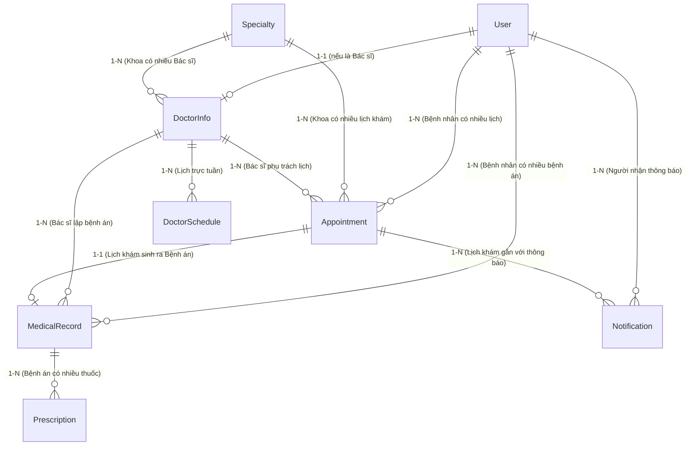
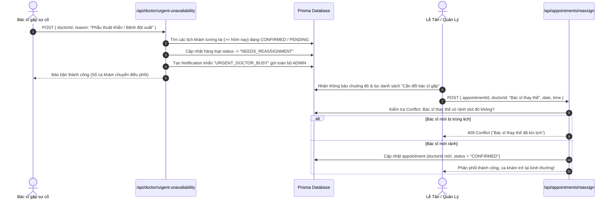

# TÀI LIỆU PHÂN TÍCH TOÀN DIỆN KIẾN TRÚC BACK-END (CAREPLUS+ 2026)
> **Dự án**: Hệ Thống Quản Lý & Đặt Lịch Khám Phòng Khám Đa Khoa CarePlus+  
> **Phiên bản**: 1.0.0 (Production-Ready)  
> **Thời gian hoàn thiện**: Năm 2026  
> **Mục đích tài liệu**: Cung cấp cái nhìn chuyên sâu, chi tiết từ tổng quan kiến trúc, công nghệ, cơ sở dữ liệu, các thuật toán logic nghiệp vụ, luồng xử lý (workflows), phân hệ xác thực, đến toàn bộ danh mục API đặc tả phục vụ phát triển, bảo trì và mở rộng hệ thống.

---

## MỤC LỤC
1. [Tổng Quan Kiến Trúc Hệ Thống (System Architecture)](#1-tổng-quan-kiến-trúc-hệ-thống-system-architecture)
2. [Chi Tiết Công Nghệ & Thư Viện Sử Dụng (Tech Stack & Dependencies)](#2-chi-tiết-công-nghệ--thư-viện-sử-dụng-tech-stack--dependencies)
3. [Mô Hình Dữ Liệu & Thiết Kế Lược Đồ (Database Schema & ERD)](#3-mô-hình-dữ-liệu--thiết-kế-lược-đồ-database-schema--erd)
4. [Phân Hệ Xác Thực & Phân Quyền (Authentication & RBAC)](#4-phân-hệ-xác-thực--phân-quyền-authentication--rbac)
5. [Chi Tiết Nghiệp Vụ & Các Luồng Xử Lý Chính (Business Logic & Workflows)](#5-chi-tiết-nghiệp-vụ--các-luồng-xử-lý-chính-business-logic--workflows)
   - [5.1. Động Cơ Tính Slot Khả Dụng & Đặt Lịch Khám](#51-động-cơ-tính-slot-khả-dụng--đặt-lịch-khám-slot-availability--booking-engine)
   - [5.2. Luồng Báo Bận Đột Xuất & Tái Phân Phối Bác Sĩ (Urgent Unavailability & Reassignment)](#52-luồng-báo-bận-đột-xuất--tái-phân-phối-bác-sĩ-urgent-unavailability--reassignment)
   - [5.3. Bệnh Án Điện Tử (EMR) & Kê Đơn Thuốc Đa Dòng](#53-bệnh-án-điện-tử-emr--kê-đơn-thuốc-đa-dòng)
   - [5.4. Động Cơ Thống Kê & Phân Tích Dữ Liệu Quản Trị (Admin Analytics Engine)](#54-động-cơ-thống-kê--phân-tích-dữ-liệu-quản-trị-admin-analytics-engine)
   - [5.5. Quản Lý Danh Mục Chuyên Khoa & Đội Ngũ Bác Sĩ (CRUD & Integrity Rules)](#55-quản-lý-danh-mục-chuyên-khoa--đội-ngũ-bác-sĩ-crud--integrity-rules)
   - [5.6. Phân Hệ Thông Báo Tự Động (In-App Notification Engine)](#56-phân-hệ-thông-báo-tự-động-in-app-notification-engine)
6. [Đặc Tả Chi Tiết Hệ Thống API (Full API Specification)](#6-đặc-tả-chi-tiết-hệ-thống-api-full-api-specification)
7. [Cơ Chế Bảo Mật & Toàn Vẹn Dữ Liệu (Security & Data Integrity)](#7-cơ-chế-bảo-mật--toàn-vẹn-dữ-liệu-security--data-integrity)
8. [Hướng Dẫn Mở Rộng & Nâng Cấp Sản Xuất (Production Scaling Guide)](#8-hướng-dẫn-mở-rộng--nâng-cấp-sản-xuất-production-scaling-guide)

---

## 1. TỔNG QUAN KIẾN TRÚC HỆ THỐNG (SYSTEM ARCHITECTURE)

Back-end của hệ thống Phòng khám CarePlus+ 2026 được xây dựng theo mô hình **Fullstack Modern Web Application** dựa trên nền tảng **Next.js 14 App Router** với kiến trúc phân tầng (Layered Architecture):

```
+-----------------------------------------------------------------------------------+
|                                 CLIENT APPLICATIONS                               |
|        (Trang chủ Khách hàng, Cổng Bệnh nhân, Bảng Bác sĩ, Portal Quản trị)      |
+-----------------------------------------------------------------------------------+
                                         │  HTTP / HTTPS / JSON
                                         ▼
+───────────────────────────────────────────────────────────────────────────────────+
|                        NEXT.JS ROUTE HANDLERS LAYER (src/app/api)                  |
|  - Auth Routes: /api/auth/login, /api/auth/register, /api/auth/profile,...         |
|  - Booking Routes: /api/appointments, /api/appointments/available-slots,...       |
|  - Doctor Routes: /api/doctors, /api/doctor/urgent-unavailability                  |
|  - Medical Routes: /api/medical-records                                            |
|  - Admin Routes: /api/admin/stats, /api/specialties                                |
|  - Notification Routes: /api/notifications                                         |
+───────────────────────────────────────────────────────────────────────────────────+
                                         │
        ┌────────────────────────────────┴────────────────────────────────┐
        ▼                                                                 ▼
+───────────────────────────────+               +───────────────────────────────────+
|      DATA VALIDATION LAYER    |               |       SECURITY & SESSION LAYER    |
|   (Zod Schemas - validations) |               |  (Bcryptjs, HttpOnly Auth Cookie, |
|  Kiểm soát payload, regex SĐT,|               |   getCurrentUser Server Resolver) |
|  logic ngày giờ tương lai     |               +───────────────────────────────────+
+───────────────────────────────+                                 │
        │                                                         │
        └────────────────────────────────┬────────────────────────┘
                                         ▼
+───────────────────────────────────────────────────────────────────────────────────+
|                          BUSINESS LOGIC & DOMAIN HELPERS                          |
|  - Thuật toán tính toán khung giờ trống (Available Slots Engine)                  |
|  - Thuật toán kiểm tra xung đột lịch khám (Conflict Detection)                     |
|  - Bộ xử lý múi giờ địa phương Việt Nam (Asia/Ho_Chi_Minh GMT+7) tránh UTC shift  |
|  - Pipeline điều phối tự động & kích hoạt cảnh báo khẩn cấp                       |
+───────────────────────────────────────────────────────────────────────────────────+
                                         │
                                         ▼
+───────────────────────────────────────────────────────────────────────────────────+
|                         DATA ACCESS LAYER (PRISMA ORM 5.x)                        |
|  - PrismaClient Singleton (src/lib/prisma.ts)                                     |
|  - Truy vấn hướng đối tượng an toàn kiểu (Type-safe queries)                      |
|  - Eager Loading & Cascade Handling tự động                                       |
+───────────────────────────────────────────────────────────────────────────────────+
                                         │
                                         ▼
+───────────────────────────────────────────────────────────────────────────────────+
|                              PERSISTENCE STORAGE                                  |
|   SQLite Engine (dev.db) - Dễ dàng chuyển đổi sang PostgreSQL / MySQL Production  |
+───────────────────────────────────────────────────────────────────────────────────+
```

### Các nguyên lý kiến trúc áp dụng:
- **Separation of Concerns (SoC)**: Phân tách rõ ràng giữa Route Handler (giao tiếp HTTP), Validation Schema (kiểm tra đầu vào), Domain Logic (xử lý nghiệp vụ) và Persistence Layer (Prisma ORM).
- **Type Safety End-to-End**: Sử dụng TypeScript đồng nhất từ giao diện (Front-end), định nghĩa Schema API, DTO (Data Transfer Object) đến cơ sở dữ liệu Prisma.
- **Fail-Safe & Graceful Degradation**: Tự động xử lý lịch trống, bắt ngoại lệ HTTP 400/404/409/500 chi tiết, phản hồi JSON thông tin thân thiện cho người dùng.

---

## 2. CHI TIẾT CÔNG NGHỆ & THƯ VIỆN SỬ DỤNG (TECH STACK & DEPENDENCIES)

| Nhóm Công Nghệ | Tên Công Nghệ / Thư Viện | Phiên Bản | Vai Trò & Lý Do Lựa Chọn |
| :--- | :--- | :--- | :--- |
| **Core Framework** | `Next.js` (App Router) | `14.2.5` | Cung cấp Route Handlers chuẩn Web Standards (`Request`/`Response`/`NextResponse`), hỗ trợ Server Components và Edge/Node.js runtime mạnh mẽ, giảm thiểu overhead triển khai API riêng biệt. |
| **Ngôn Ngữ** | `TypeScript` | `^5.5.4` | Đảm bảo tính toàn vẹn kiểu dữ liệu ở thời điểm biên dịch, ngăn ngừa lỗi runtime `undefined` / `null`, sinh type tự động từ Prisma Client. |
| **Data Access / ORM** | `Prisma ORM` | `^5.18.0` | ORM chuẩn công nghiệp: tự động sinh client type-safe, trực quan hóa lược đồ quan hệ trong `schema.prisma`, công cụ trực quan `Prisma Studio` giúp quản trị viên duyệt DB trực tiếp. |
| **Database Engine** | `SQLite` (`dev.db`) | Nhúng | Hệ quản trị CSDL quan hệ gọn nhẹ, phi máy chủ (zero-configuration), bảo toàn tính toàn vẹn dữ liệu ACID, hỗ trợ quan hệ 1-1, 1-N, N-N, sẵn sàng chuyển đổi PostgreSQL chỉ qua 1 dòng config. |
| **Validation Layer** | `Zod` | `^3.23.8` | Xác thực dữ liệu đầu vào (Input validation) ở cấp độ Controller và Client form, kiểm tra định dạng số điện thoại Việt Nam qua Regex, chuẩn hoá kiểu ngày tháng. |
| **Bảo Mật & Mã Hóa**| `bcryptjs` | `^2.4.3` | Băm mật khẩu (Password hashing) một chiều kết hợp muối (Salt rounds = 10), đảm bảo an toàn tuyệt đối ngay cả khi dữ liệu bị lộ lọt. |
| **Session Management**| `Next.js Cookies API` | Built-in | Quản lý phiên qua cookie `phongkham_session_user` thiết lập cờ `HttpOnly: true`, `Path: '/'`, `Max-Age: 7 ngày` chống tấn công XSS trộm token. |
| **Xử Lý Ngày & Giờ** | `date-fns` & `Intl` API | `^3.6.0` | Xử lý format ngày giờ chuẩn định dạng Tiếng Việt, khắc phục triệt để lỗi lệch ngày do múi giờ UTC (chuyển đổi chuẩn xác về múi giờ `Asia/Ho_Chi_Minh` UTC+7). |
| **Seeding & Tools** | `tsx` | `^4.17.0` | Trình thực thi TypeScript cấp tốc không cần build trung gian, phục vụ seed dữ liệu mẫu 10 chuyên khoa và 30 bác sĩ thực tế (`npx tsx prisma/seed.ts`). |

---

## 3. MÔ HÌNH DỮ LIỆU & THIẾT KẾ LƯỢC ĐỒ (DATABASE SCHEMA & ERD)

### 3.1. Sơ Đồ Thực Thể Quan Hệ (Mermaid ERD)



---

### 3.2. Chi Tiết Các Bảng Dữ Liệu (Data Dictionary)

#### 1. Bảng `User` (Người dùng hệ thống)
Lưu trữ toàn bộ tài khoản gồm Quản trị viên (ADMIN), Bác sĩ (DOCTOR) và Bệnh nhân (PATIENT).

| Cột | Kiểu Dữ Liệu | Ràng Buộc | Ý Nghĩa / Mô Tả |
| :--- | :--- | :--- | :--- |
| `id` | String | PK, UUID | Định danh duy nhất người dùng. |
| `fullName` | String | NOT NULL | Họ và tên đầy đủ. |
| `email` | String | UNIQUE, NOT NULL | Địa chỉ hòm thư điện tử (dùng đăng nhập hoặc định danh). |
| `phone` | String | NOT NULL | Số điện thoại di động chính (định dạng 10 số). |
| `passwordHash` | String | NOT NULL | Mật khẩu đã được mã hoá băm bằng Bcrypt (Salt 10). |
| `role` | String | DEFAULT 'PATIENT'| Phân quyền: `'ADMIN'`, `'DOCTOR'`, `'PATIENT'`. |
| `avatarUrl` | String? | NULLABLE | Đường dẫn ảnh đại diện chân dung. |
| `createdAt` | DateTime | DEFAULT now() | Thời điểm tạo tài khoản. |

#### 2. Bảng `Specialty` (Chuyên khoa khám bệnh)
Lưu danh mục chuyên khoa của phòng khám (hiện hỗ trợ 10 chuyên khoa chuẩn y tế).

| Cột | Kiểu Dữ Liệu | Ràng Buộc | Ý Nghĩa / Mô Tả |
| :--- | :--- | :--- | :--- |
| `id` | String | PK, UUID | Mã định danh chuyên khoa. |
| `name` | String | NOT NULL | Tên chuyên khoa (Tim Mạch, Nhi, Da Liễu, Mắt,...). |
| `description`| String | NOT NULL | Mô tả năng lực điều trị & danh mục dịch vụ. |
| `iconUrl` | String? | NULLABLE | Tên biểu tượng Lucide hoặc URL icon minh hoạ. |

#### 3. Bảng `DoctorInfo` (Hồ sơ chuyên môn Bác sĩ)
Mở rộng từ thực thể `User` cho các nhân sự mang quyền `DOCTOR`.

| Cột | Kiểu Dữ Liệu | Ràng Buộc | Ý Nghĩa / Mô Tả |
| :--- | :--- | :--- | :--- |
| `id` | String | PK, UUID | Mã định danh bác sĩ. |
| `userId` | String | UNIQUE, FK `User(id)` | Liên kết tài khoản người dùng tương ứng (OnDelete: Cascade). |
| `specialtyId`| String | FK `Specialty(id)` | Chuyên khoa trực thuộc (OnDelete: Cascade). |
| `degree` | String | NOT NULL | Học vị / Học hàm (ThS BS, BS CKI, BS CKII, TS BS,...). |
| `experienceYears`| Int | NOT NULL | Số năm kinh nghiệm công tác lâm sàng. |
| `bio` | String | NOT NULL | Tiểu sử giới thiệu kinh nghiệm và chuyên môn sâu. |
| `consultationFee`| Float | NOT NULL | Giá khám ban đầu (USD/VND) phục vụ tính doanh thu. |

#### 4. Bảng `DoctorSchedule` (Lịch làm việc cố định trong tuần)
| Cột | Kiểu Dữ Liệu | Ràng Buộc | Ý Nghĩa / Mô Tả |
| :--- | :--- | :--- | :--- |
| `id` | String | PK, UUID | Mã định danh lịch làm việc. |
| `doctorId` | String | FK `DoctorInfo(id)` | Bác sĩ trực (OnDelete: Cascade). |
| `dayOfWeek`| Int | NOT NULL (0-6) | Thứ trong tuần: `0` (Chủ Nhật) đến `6` (Thứ Bảy). |
| `startTime`| String | NOT NULL ("08:00")| Giờ bắt đầu ca khám sáng. |
| `endTime` | String | NOT NULL ("17:00")| Giờ kết thúc ca khám chiều. |
| `slotDurationMinutes`| Int | DEFAULT 30 | Thời lượng khám chuẩn mỗi ca (30 phút). |

#### 5. Bảng `Appointment` (Lịch hẹn khám bệnh)
Bảng trung tâm liên kết Bệnh nhân, Bác sĩ, Chuyên khoa, Bệnh án và Thông báo.

| Cột | Kiểu Dữ Liệu | Ràng Buộc | Ý Nghĩa / Mô Tả |
| :--- | :--- | :--- | :--- |
| `id` | String | PK, UUID | Mã hồ sơ lịch hẹn. |
| `patientId` | String | FK `User(id)` | Mã bệnh nhân (OnDelete: Cascade). |
| `doctorId` | String? | FK `DoctorInfo(id)` | Mã bác sĩ được phân công (NULL nếu chờ gán, OnDelete: SetNull). |
| `specialtyId`| String | FK `Specialty(id)` | Mã chuyên khoa khám. |
| `appointmentDate`| String| NOT NULL ("YYYY-MM-DD")| Ngày khám theo giờ chuẩn Việt Nam. |
| `appointmentTime`| String| NOT NULL ("HH:mm") | Giờ hẹn khám (ví dụ: "09:00", "14:30"). |
| `status` | String | DEFAULT 'PENDING' | Trạng thái: `PENDING`, `CONFIRMED`, `COMPLETED`, `CANCELLED`, `NEEDS_REASSIGNMENT`. |
| `bookingType`| String | DEFAULT 'SELF_SELECTED' | Hình thức đặt: `SELF_SELECTED` (chọn bác sĩ) hoặc `AUTO_ASSIGN` (phòng khám phân bổ). |
| `patientNotes`| String? | NULLABLE | Triệu chứng ban đầu hoặc ghi chú bệnh nhân gửi kèm. |
| `createdAt` | DateTime | DEFAULT now() | Thời gian khởi tạo lịch hẹn. |

#### 6. Bảng `MedicalRecord` (Bệnh án điện tử EMR)
Lưu kết quả khám sau khi bác sĩ tiếp nhận bệnh nhân.

| Cột | Kiểu Dữ Liệu | Ràng Buộc | Ý Nghĩa / Mô Tả |
| :--- | :--- | :--- | :--- |
| `id` | String | PK, UUID | Mã bệnh án điện tử. |
| `appointmentId` | String | UNIQUE, FK `Appointment(id)` | Gắn với lịch hẹn duy nhất (OnDelete: Cascade). |
| `patientId` | String | FK `User(id)` | Bệnh nhân được khám. |
| `doctorId` | String | FK `DoctorInfo(id)` | Bác sĩ thực hiện khám và ký bệnh án. |
| `symptoms` | String | NOT NULL | Triệu chứng lâm sàng ghi nhận. |
| `diagnosis`| String | NOT NULL | Kết luận chẩn đoán y khoa. |
| `notes` | String? | NULLABLE | Lời dặn dò dinh dưỡng, sinh hoạt, hẹn tái khám. |
| `createdAt` | DateTime | DEFAULT now() | Thời điểm lập hồ sơ bệnh án. |

#### 7. Bảng `Prescription` (Đơn thuốc chi tiết)
| Cột | Kiểu Dữ Liệu | Ràng Buộc | Ý Nghĩa / Mô Tả |
| :--- | :--- | :--- | :--- |
| `id` | String | PK, UUID | Mã thuốc trong đơn. |
| `medicalRecordId`| String | FK `MedicalRecord(id)` | Bệnh án chứa đơn thuốc này (OnDelete: Cascade). |
| `medicineName` | String | NOT NULL | Tên thuốc (Amlodipine, Paracetamol,...). |
| `dosage` | String | NOT NULL | Liều lượng / Hàm lượng (500mg, 1 viên,...). |
| `frequency` | String | NOT NULL | Tần suất dùng (Uống 2 lần/ngày sau ăn,...). |
| `duration` | String | NOT NULL | Thời gian dùng thuốc (5 ngày, 30 ngày,...). |
| `notes` | String? | NULLABLE | Lưu ý đặc biệt khi uống thuốc. |

#### 8. Bảng `Notification` (Hệ thống thông báo nội bộ)
| Cột | Kiểu Dữ Liệu | Ràng Buộc | Ý Nghĩa / Mô Tả |
| :--- | :--- | :--- | :--- |
| `id` | String | PK, UUID | Mã thông báo. |
| `userId` | String | FK `User(id)` | Người nhận thông báo (Bác sĩ hoặc Admin). |
| `appointmentId`| String?| FK `Appointment(id)` | Lịch hẹn liên quan (nếu có, OnDelete: SetNull). |
| `message` | String | NOT NULL | Nội dung chi tiết thông báo. |
| `type` | String | DEFAULT 'GENERAL' | Loại thông báo: `URGENT_DOCTOR_BUSY`, `NEW_BOOKING`, `CANCELLED`, `GENERAL`. |
| `isRead` | Boolean | DEFAULT false | Cờ đánh dấu đã đọc (`true` / `false`). |
| `createdAt` | DateTime | DEFAULT now() | Thời điểm gửi thông báo. |

---

## 4. PHÂN HỆ XÁC THỰC & PHÂN QUYỀN (AUTHENTICATION & RBAC)

Back-end cài đặt mô hình phân quyền dựa trên vai trò **Role-Based Access Control (RBAC)** với 3 vai trò chính:
1. **`ADMIN` (Quản trị viên / Trưởng Lễ Tân)**:
   - Truy cập toàn quyền vào Bảng quản trị `/admin`.
   - Xem toàn bộ lịch hẹn, doanh thu, KPI thời gian thực.
   - Điều phối bác sĩ, chỉ định bác sĩ mới cho các ca `PENDING` hoặc `NEEDS_REASSIGNMENT`.
   - Quản lý danh mục Chuyên khoa và Đội ngũ Bác sĩ (Thêm/Sửa/Xóa).
2. **`DOCTOR` (Bác sĩ chuyên khoa)**:
   - Truy cập Bảng bác sĩ `/doctor`.
   - Xem lịch khám cá nhân được phân bổ theo ngày.
   - Lập bệnh án điện tử, chẩn đoán và kê đơn thuốc cho bệnh nhân.
   - Kích hoạt tính năng **Báo bận đột xuất** thông báo khẩn cấp tới ban quản lý.
3. **`PATIENT` (Bệnh nhân)**:
   - Đặt lịch khám trực tuyến (theo Bác sĩ hoặc theo Chuyên khoa).
   - Tra cứu lịch sử khám bệnh và bệnh án điện tử qua số điện thoại hoặc tài khoản.
   - Quản lý hồ sơ cá nhân và hủy lịch hẹn khi có thay đổi kế hoạch.

### Cơ Chế Quản Lý Phiên (Session Management)

```mermaid
sequenceDiagram
    autonumber
    actor Client as Người dùng / Client
    participant AuthAPI as /api/auth/login
    participant DB as Prisma / SQLite
    participant Server as Next.js Server (API / SSR)

    Client->>AuthAPI: POST { identifier, password }
    AuthAPI->>DB: Tìm User theo SĐT hoặc Email
    alt Không tìm thấy User
        AuthAPI-->>Client: 401 Unauthorized (Sai tài khoản/mật khẩu)
    else Tìm thấy User
        AuthAPI->>AuthAPI: bcrypt.compare(password, passwordHash)
        alt Mật khẩu không khớp
            AuthAPI-->>Client: 401 Unauthorized
        else Mật khẩu hợp lệ
            AuthAPI->>AuthAPI: Khởi tạo payload sessionData (id, fullName, role, doctorId,...)
            AuthAPI->>Client: Set-Cookie: phongkham_session_user=...; HttpOnly; Path=/; Max-Age=7d
            AuthAPI-->>Client: 200 OK + User Info
        end
    end

    Note over Client,Server: Trong các request tiếp theo:
    Client->>Server: Request kèm Cookie "phongkham_session_user"
    Server->>Server: Gọi getCurrentUser() giải mã Cookie & xác minh trạng thái trong DB
    Server-->>Client: Trả về kết quả phù hợp với Role
```

- **Hàm `getCurrentUser()`** (`src/lib/auth.ts`): Trích xuất cookie từ `next/headers`, phân tích cú pháp JSON và đồng bộ lại trạng thái người dùng từ DB (`prisma.user.findUnique`) kèm thông tin `doctorInfo` để đảm bảo quyền hạn luôn cập nhật theo thời gian thực (real-time sync).
- **Tính năng Chuyển Đổi Nhanh Role Demo (`/api/auth/switch-role`)**: Cho phép chuyển đổi tức thì giữa các phiên làm việc của Admin, Bác sĩ và Bệnh nhân mà không cần nhập lại mật khẩu, phục vụ trải nghiệm thẩm định hệ thống nhanh chóng.

---

## 5. CHI TIẾT NGHIỆP VỤ & CÁC LUỒNG XỬ LÝ CHÍNH (BUSINESS LOGIC & WORKFLOWS)

### 5.1. Động Cơ Tính Slot Khả Dụng & Đặt Lịch Khám (Slot Availability & Booking Engine)

Khung giờ chuẩn của phòng khám được chia thành:
- **Buổi sáng**: 8 khung giờ (`08:00`, `08:30`, `09:00`, `09:30`, `10:00`, `10:30`, `11:00`, `11:30`).
- **Buổi chiều**: 8 khung giờ (`13:30`, `14:00`, `14:30`, `15:00`, `15:30`, `16:00`, `16:30`, `17:00`).
- Tổng cộng: **16 khung giờ tiêu chuẩn / ngày**.

#### Thuật toán xác định slot trống (`/api/appointments/available-slots`):
1. **Trường hợp Khách chọn Bác sĩ cụ thể (`doctorId != 'AUTO_ASSIGN'`)**:
   - Truy vấn toàn bộ lịch khám của bác sĩ đó trong ngày đã chọn có trạng thái khác `CANCELLED`.
   - Slot khả dụng = `ALL_STANDARD_SLOTS` loại bỏ các slot đã bị đặt.
2. **Trường hợp Đặt theo Chuyên khoa tự động (`AUTO_ASSIGN`)**:
   - Truy vấn danh sách $N$ bác sĩ thuộc chuyên khoa đó.
   - Thống kê số lượng ca khám đã được đặt theo từng khung giờ trong ngày.
   - Một khung giờ được coi là khả dụng nếu: $\text{bookedCount} < N$ (vẫn còn ít nhất 1 bác sĩ trong khoa chưa bị kín lịch).
   - Nếu $\text{bookedCount} \ge N$, đánh dấu slot đó đã kín: `"Đã kín lịch tất cả bác sĩ"`.

#### Luồng Đặt Khám Bệnh Nhân Vãng Lai (Guest Booking Auto-Provisioning):
Nếu người đặt lịch chưa đăng nhập, hệ thống sẽ:
1. Tìm kiếm trong bảng `User` xem số điện thoại hoặc email đã tồn tại hay chưa.
2. Nếu đã tồn tại: tự động liên kết lịch hẹn với `patientId` của người dùng đó.
3. Nếu chưa tồn tại: tự động sinh một tài khoản Bệnh nhân mới với mật khẩu mặc định được băm bảo mật (`password123`) và số điện thoại cung cấp, giúp bệnh nhân tra cứu lại lịch sử mà không bị gián đoạn trải nghiệm đặt lịch.

---

### 5.2. Luồng Báo Bận Đột Xuất & Tái Phân Phối Bác Sĩ (Urgent Unavailability & Reassignment)

Đây là một trong những nghiệp vụ y tế quan trọng nhất của hệ thống nhằm đảm bảo bệnh nhân không bị hủy khám đột ngột mà luôn được lễ tân điều phối bác sĩ khác thay thế.



---

### 5.3. Bệnh Án Điện Tử (EMR) & Kê Đơn Thuốc Đa Dòng

Khi bác sĩ tiếp nhận bệnh nhân theo ca hẹn:
1. Route `/api/medical-records` tiếp nhận payload gồm:
   - `appointmentId`, `symptoms` (triệu chứng), `diagnosis` (chẩn đoán), `notes` (lời dặn).
   - Mảng `prescriptions` gồm: `medicineName`, `dosage`, `frequency`, `duration`, `notes`.
2. **Tính Nguyên Tử (Atomicity)**:
   - Tạo bản ghi `MedicalRecord` gắn với `appointmentId`.
   - Batch insert toàn bộ các dòng thuốc thông qua `prisma.prescription.createMany`.
   - Cập nhật trạng thái lịch hẹn `Appointment` sang `COMPLETED`.
3. Bệnh nhân có thể tra cứu ngay đơn thuốc và kết quả chẩn đoán trên trang cá nhân hoặc lịch hẹn.

---

### 5.4. Động Cơ Thống Kê & Phân Tích Dữ Liệu Quản Trị (Admin Analytics Engine)

Route `/api/admin/stats` cung cấp bộ tính toán tổng hợp chuyên sâu phục vụ Dashboard quản lý:
- **KPI Ngày Hiện Tại & Toàn Thời Gian**:
  - Tổng số ca khám, số ca hoàn thành, số ca chờ, số ca cần đổi bác sĩ khẩn cấp, số ca đã hủy.
  - Tỷ lệ hoàn thành khám = $\frac{\text{Số ca COMPLETED}}{\text{Tổng ca} - \text{Số ca CANCELLED}} \times 100\%$.
  - Tỷ lệ hủy lịch = $\frac{\text{Số ca CANCELLED}}{\text{Tổng ca}} \times 100\%$.
- **Doanh Thu Ước Tính (Revenue Analytics)**:
  - Tính dựa trên tổng `consultationFee` của từng bác sĩ phụ trách ca khám đã hoàn thành (`COMPLETED`) hoặc đã xác nhận (`CONFIRMED`).
- **Phân Tích Xu Hướng Thời Gian (Weekly & 14-Day Trends)**:
  - Sử dụng helper `getRecentDaysVN(7)` và `getRecentDaysVN(14)` để nhóm dữ liệu theo từng ngày theo múi giờ Việt Nam (`Asia/Ho_Chi_Minh`), thể hiện số ca khám, số ca hoàn tất và số ca hủy.
- **Bảng Xếp Hạng Năng Suất Bác Sĩ (Doctor Workload & Leaderboard)**:
  - Thống kê từng bác sĩ: Số ca khám đã nhận, số ca đã hoàn thành, tổng doanh thu đóng góp, tỷ lệ đáp ứng.
- **Mật Độ Khung Giờ Khám (Time Slot Distribution)**:
  - Phân bổ buổi sáng vs buổi chiều, biểu đồ số lượng đặt khám theo từng mốc giờ (08:00, 09:00, 10:00,...) giúp phòng khám bố trí nhân sự giờ cao điểm.

---

### 5.5. Quản Lý Danh Mục Chuyên Khoa & Đội Ngũ Bác Sĩ (CRUD & Integrity Rules)

#### Khi Xóa Bác Sĩ (`DELETE /api/doctors`):
Để đảm bảo cơ sở dữ liệu không bị lỗi tham chiếu mồ côi (Foreign Key Constraint Violation) và không làm mất lịch hẹn của bệnh nhân:
1. Các ca khám tương lai đang `CONFIRMED` hoặc `PENDING` được gỡ `doctorId = null` và chuyển trạng thái thành `NEEDS_REASSIGNMENT` để Lễ tân điều phối bác sĩ khác.
2. Các ca khám cũ (đã xong hoặc đã hủy) được gỡ liên kết `doctorId = null`.
3. Xóa các lịch trực tuần `DoctorSchedule` của bác sĩ.
4. Xóa đơn thuốc và bệnh án do bác sĩ đó tạo (hoặc lưu trữ theo quy chế phòng khám).
5. Xóa bản ghi `DoctorInfo` và tài khoản `User` của bác sĩ.
6. Tự động gửi thông báo hệ thống đến Quản trị viên ghi nhận việc gỡ bỏ bác sĩ.

#### Khi Xóa Chuyên Khoa (`DELETE /api/specialties`):
Thực hiện dọn dẹp phân tầng liên hoàn: các bác sĩ thuộc khoa, lịch trực, đơn thuốc, lịch hẹn liên đới đều được xử lý an toàn trước khi xóa bản ghi chuyên khoa.

---

### 5.6. Phân Hệ Thông Báo Tự Động (In-App Notification Engine)

Back-end tự động tạo thông báo trong bảng `Notification` dựa trên các sự kiện hệ thống:
- **`NEW_BOOKING`**: Khi có bệnh nhân đặt lịch hẹn mới -> Thông báo tới Quản trị viên.
- **`URGENT_DOCTOR_BUSY`**: Khi bác sĩ báo bận đột xuất -> Gửi thông báo cảnh báo đỏ khẩn cấp tới toàn bộ Quản trị viên/Lễ tân.
- **`CANCELLED`**: Khi bệnh nhân hủy lịch khám -> Thông báo tới Quản trị viên và Bác sĩ phụ trách.
- Hỗ trợ API đọc thông báo: Đánh dấu đã đọc từng tin (`PUT /api/notifications` kèm `notificationId`) hoặc đánh dấu đã đọc tất cả (`mark-all-as-read`).

---

## 6. ĐẶC TẢ CHI TIẾT HỆ THỐNG API (FULL API SPECIFICATION)

### 6.1. Phân Hệ Xác Thực & Tài Khoản (Authentication & Profile)

| STT | Phương Thức | Endpoint URL | Mục Đích | Tham Số / Body Request | Mã HTTP Phản Hồi |
| :---: | :---: | :--- | :--- | :--- | :---: |
| 1 | `POST` | `/api/auth/login` | Đăng nhập hệ thống bằng SĐT/Email | `{ phone/email, password }` | `200` (Set-Cookie), `400`, `401`, `500` |
| 2 | `POST` | `/api/auth/register` | Đăng ký tài khoản Bệnh nhân mới | `{ fullName, phone, password, email? }` | `201` (Set-Cookie), `400`, `500` |
| 3 | `POST` | `/api/auth/logout` | Đăng xuất người dùng | Không có | `200` (Clear-Cookie) |
| 4 | `GET` | `/api/auth/me` | Lấy thông tin phiên hiện tại | Cookie `phongkham_session_user` | `200` (User Object / null) |
| 5 | `PUT` | `/api/auth/profile` | Cập nhật hồ sơ & mật khẩu | `{ fullName, phone, email, avatarUrl, currentPassword?, newPassword? }` | `200`, `400`, `401`, `500` |
| 6 | `POST` | `/api/auth/forgot-password` | Yêu cầu gửi OTP đặt lại mật khẩu | `{ phone }` | `200` (Trả về OTP mô phỏng), `400`, `404` |
| 7 | `POST` | `/api/auth/reset-password` | Xác thực OTP & đổi mật khẩu mới | `{ phone, otp, newPassword }` | `200`, `400`, `404`, `500` |
| 8 | `POST` | `/api/auth/switch-role` | Chuyển đổi vai trò demo nhanh | `{ role: 'ADMIN' \| 'DOCTOR' \| 'PATIENT' }` | `200` (Cập nhật Cookie mới) |

---

### 6.2. Phân Hệ Lịch Hẹn & Điều Phối (Appointments & Scheduling)

| STT | Phương Thức | Endpoint URL | Mục Đích | Tham Số Query / Body Request | Mã HTTP Phản Hồi |
| :---: | :---: | :--- | :--- | :--- | :---: |
| 9 | `GET` | `/api/appointments` | Lấy danh sách lịch hẹn (Bộ lọc đa năng) | Query: `patientId`, `phone`, `doctorId`, `status`, `specialtyId`, `date` | `200` (Danh sách đầy đủ chi tiết) |
| 10 | `POST` | `/api/appointments` | Đặt lịch khám mới / Khách vãng lai | Body: `{ patientId?, fullName?, phone?, email?, specialtyId, doctorId?, appointmentDate, appointmentTime, bookingType, patientNotes? }` | `201` (Khởi tạo thành công), `500` |
| 11 | `PATCH` | `/api/appointments` | Cập nhật trạng thái / Đổi giờ / Hủy | Body: `{ appointmentId, status?, appointmentDate?, appointmentTime?, patientNotes? }` | `200`, `400`, `404`, `500` |
| 12 | `GET` | `/api/appointments/available-slots` | Tính toán slot khả dụng trong ngày | Query: `date` (YYYY-MM-DD), `specialtyId`, `doctorId` (hoặc `AUTO_ASSIGN`) | `200` (`{ allSlots, availableSlots, morningSlots, afternoonSlots }`) |
| 13 | `POST` | `/api/appointments/assign` | Quản trị viên chỉ định bác sĩ khám | Body: `{ appointmentId, doctorId }` | `200` (Confirmed), `400`, `404`, `409` (Conflict) |
| 14 | `POST` | `/api/appointments/reassign` | Đổi bác sĩ / Đổi khung giờ khẩn cấp | Body: `{ appointmentId, doctorId, appointmentDate?, appointmentTime? }` | `200` (Confirmed), `400`, `404`, `409` (Conflict) |

---

### 6.3. Phân Hệ Bác Sĩ & Báo Bận (Doctor & Medical Operations)

| STT | Phương Thức | Endpoint URL | Mục Đích | Tham Số / Body Request | Mã HTTP Phản Hồi |
| :---: | :---: | :--- | :--- | :--- | :---: |
| 15 | `GET` | `/api/doctors` | Lấy danh sách bác sĩ & lịch trực | Query: `specialtyId` (tuỳ chọn) | `200` (Kèm thông tin user & schedule) |
| 16 | `POST` | `/api/doctors` | Thêm bác sĩ mới vào hệ thống | Body: `{ fullName, email, phone, specialtyId, degree, experienceYears, bio, consultationFee, avatarUrl }` | `201`, `400`, `409` (Email trùng) |
| 17 | `PUT` | `/api/doctors` | Chỉnh sửa thông tin bác sĩ | Body: `{ id, fullName, email, phone, specialtyId, degree, experienceYears, bio, consultationFee, avatarUrl }` | `200`, `400`, `404`, `409` |
| 18 | `DELETE` | `/api/doctors` | Xóa bác sĩ & giải phóng lịch hẹn | Query hoặc Body: `{ id: doctorId }` | `200`, `400`, `404`, `500` |
| 19 | `POST` | `/api/doctor/urgent-unavailability` | Bác sĩ kích hoạt báo bận khẩn | Body: `{ doctorId?, reason }` | `200` (Chuyển ca sang NEEDS_REASSIGNMENT) |
| 20 | `POST` | `/api/medical-records` | Bác sĩ lập bệnh án & kê đơn | Body: `{ appointmentId, symptoms, diagnosis, notes?, prescriptions: [{ medicineName, dosage, frequency, duration, notes? }] }` | `201` (Tạo bệnh án & đánh dấu COMPLETED) |

---

### 6.4. Phân Hệ Quản Trị, Chuyên Khoa & Thông Báo (Admin, Specialties, Notifications)

| STT | Phương Thức | Endpoint URL | Mục Đích | Tham Số / Body Request | Mã HTTP Phản Hồi |
| :---: | :---: | :--- | :--- | :--- | :---: |
| 21 | `GET` | `/api/specialties` | Danh sách chuyên khoa & số lượng BS | Không có | `200` (Kèm `_count: { doctors, appointments }`) |
| 22 | `POST` | `/api/specialties` | Tạo chuyên khoa mới | Body: `{ name, description, iconUrl }` | `201`, `400`, `409` (Trùng tên khoa) |
| 23 | `PUT` | `/api/specialties` | Cập nhật chuyên khoa | Body: `{ id, name, description, iconUrl }` | `200`, `400`, `404`, `409` |
| 24 | `DELETE` | `/api/specialties` | Xóa chuyên khoa & dọn dẹp dữ liệu | Query hoặc Body: `{ id: specialtyId }` | `200`, `400`, `404`, `500` |
| 25 | `GET` | `/api/admin/stats` | Thống kê KPI, doanh thu, biểu đồ | Không có | `200` (Toàn bộ dữ liệu phân tích BI) |
| 26 | `GET` | `/api/notifications` | Lấy 20 thông báo gần nhất của user | Cookie xác thực | `200` (Kèm chi tiết lịch hẹn) |
| 27 | `PUT` | `/api/notifications` | Đánh dấu thông báo đã đọc | Body: `{ notificationId? }` (nếu rỗng = đọc tất cả) | `200` |

---

## 7. CƠ CHẾ BẢO MẬT & TOÀN VẸN DỮ LIỆU (SECURITY & DATA INTEGRITY)

1. **Mã Hóa Mật Khẩu (One-Way Hashing)**:
   - Sử dụng thư viện `bcryptjs` với 10 vòng sinh muối (Salt rounds).
   - Mật khẩu gốc không bao giờ được lưu trữ dưới dạng bản rõ (plaintext) trong cơ sở dữ liệu.
2. **Bảo Mật Cookie Phiên Làm Việc (HttpOnly Session Protection)**:
   - Cờ `httpOnly: true`: Ngăn chặn hoàn toàn việc mã độc JavaScript trên trình duyệt (XSS) đọc trộm cookie phiên.
   - Cờ `path: '/'` và thời hạn `maxAge: 7 ngày` đảm bảo tính liên tục của phiên làm việc.
3. **Kiểm Soát Xung Đột Lịch Hẹn Chặt Chẽ (Double Booking Prevention)**:
   - Trong các API gán bác sĩ (`/api/appointments/assign`, `/api/appointments/reassign`), hệ thống luôn thực hiện truy vấn kiểm tra trùng lặp:
     ```typescript
     const conflict = await prisma.appointment.findFirst({
       where: {
         doctorId,
         appointmentDate: targetDate,
         appointmentTime: targetTime,
         status: { notIn: ['CANCELLED'] },
         id: { not: appointmentId },
       },
     });
     if (conflict) {
       return NextResponse.json({ error: 'Selected doctor is busy...' }, { status: 409 });
     }
     ```
   - Trả về mã lỗi `409 Conflict`, ngăn chặn triệt để tình trạng hai bệnh nhân cùng đặt một bác sĩ vào cùng một khung giờ.
4. **Xử Lý Múi Giờ Việt Nam Chính Xác (Timezone Offset Neutralization)**:
   - Tránh hiện tượng lệch ngày khi chuyển đổi UTC trên Server Node.js bằng hàm tiện ích định dạng trực tiếp theo múi giờ `Asia/Ho_Chi_Minh`:
     ```typescript
     new Intl.DateTimeFormat('en-CA', {
       timeZone: 'Asia/Ho_Chi_Minh',
       year: 'numeric',
       month: '2-digit',
       day: '2-digit',
     }).format(date);
     ```

---

## 8. HƯỚNG DẪN MỞ RỘNG & NÂNG CẤP SẢN XUẤT (PRODUCTION SCALING GUIDE)

Khi triển khai hệ thống lên môi trường thực tế quy mô lớn, kiến trúc Back-end của CarePlus+ có thể nâng cấp mượt mà qua các bước:

1. **Chuyển Đổi Sang Cơ Sở Dữ Liệu PostgreSQL / MySQL**:
   - Cập nhật file `prisma/schema.prisma`:
     ```prisma
     datasource db {
       provider = "postgresql"
       url      = env("DATABASE_URL")
     }
     ```
   - Chạy lệnh `npx prisma db push` hoặc `npx prisma migrate dev` để tạo schema trên cụm DB đám mây (AWS RDS, Supabase hoặc Neon).
2. **Tích Hợp SMS Gateway / Zalo ZNS / SendGrid Gửi OTP Thật**:
   - Thay thế việc sinh mã OTP ngẫu nhiên trong `/api/auth/forgot-password` bằng lệnh gọi API đến nhà mạng (SpeedSMS, eSMS, Zalo Notification Service) gửi mã xác thực 6 số trực tiếp đến điện thoại của bệnh nhân.
3. **Tích Hợp Cổng Thanh Toán Trực Tuyến**:
   - Bổ sung bảng `PaymentTransaction` và tích hợp VNPAY / MoMo IPN Webhook để thanh toán phí khám trước khi chuyển lịch hẹn sang `CONFIRMED`.
4. **Hệ Thống Real-time Socket / Server-Sent Events (SSE)**:
   - Nâng cấp luồng thông báo khẩn cấp `URGENT_DOCTOR_BUSY` từ cơ chế polling sang Server-Sent Events (SSE) hoặc Pusher/WebSocket để màn hình lễ tân nhấp nháy chuông báo ngay khi bác sĩ vừa gửi yêu cầu.

---
*Tài liệu được biên soạn và bảo trì bởi Đội ngũ Kỹ sư Phát triển Hệ thống CarePlus+ 2026.*
