# 🗄️ TÀI LIỆU THIẾT KẾ SƠ ĐỒ THỰC THỂ QUAN HỆ (ERD SPECIFICATION)
## DỰ ÁN: HỆ THỐNG QUẢN LÝ & ĐẶT LỊCH PHÒNG KHÁM ĐA KHOA CAREPLUS 2026

---

## 📌 TỔNG QUAN VỀ THIẾT KẾ CƠ SỞ DỮ LIỆU
Cơ sở dữ liệu của hệ thống phòng khám **CarePlus 2026** được xây dựng trên hệ quản trị **SQLite** thông qua **Prisma ORM**, tuân thủ nghiêm ngặt **Dạng chuẩn 3 (3NF - Third Normal Form)** nhằm loại bỏ dư thừa dữ liệu và đảm bảo tính toàn vẹn tham chiếu (Referential Integrity).

### Hệ thống bao gồm 8 thực thể dữ liệu cốt lõi:
1. **User**: Người dùng toàn hệ thống (Bệnh nhân, Bác sĩ, Quản trị viên).
2. **Specialty**: Danh mục 10 Chuyên khoa y tế.
3. **DoctorInfo**: Thông tin chuyên môn mở rộng của Bác sĩ (học vị, kinh nghiệm, biểu phí khám).
4. **DoctorSchedule**: Khung thời gian làm việc & ca trực trong tuần của Bác sĩ.
5. **Appointment**: Phiếu đặt lịch khám bệnh & tiến trình lịch hẹn.
6. **MedicalRecord**: Hồ sơ bệnh án điện tử sau khi bác sĩ tiến hành khám.
7. **Prescription**: Danh mục thuốc kê trong đơn thuốc điện tử.
8. **Notification**: Thông báo hệ thống gửi tới người dùng.

---

## 1. SƠ ĐỒ THỰC THỂ QUAN HỆ (ERD - CROW'S FOOT NOTATION)

```mermaid
erDiagram
    %% 1. Mối quan hệ User và DoctorInfo (1 - 0..1)
    User ||--o| DoctorInfo : "has profile (1:0..1)"

    %% 2. Mối quan hệ Specialty và DoctorInfo (1 - N)
    Specialty ||--o{ DoctorInfo : "categorizes (1:N)"

    %% 3. Mối quan hệ DoctorInfo và DoctorSchedule (1 - N)
    DoctorInfo ||--o{ DoctorSchedule : "schedules (1:N)"

    %% 4. Mối quan hệ Specialty và Appointment (1 - N)
    Specialty ||--o{ Appointment : "booked under (1:N)"

    %% 5. Mối quan hệ User (Patient) và Appointment (1 - N)
    User ||--o{ Appointment : "books (1:N)"

    %% 6. Mối quan hệ DoctorInfo và Appointment (0..1 - N)
    DoctorInfo |o--o{ Appointment : "conducts (0..1:N)"

    %% 7. Mối quan hệ Appointment và MedicalRecord (1 - 0..1)
    Appointment ||--o| MedicalRecord : "produces (1:0..1)"

    %% 8. Mối quan hệ User (Patient) và MedicalRecord (1 - N)
    User ||--o{ MedicalRecord : "owns (1:N)"

    %% 9. Mối quan hệ DoctorInfo và MedicalRecord (1 - N)
    DoctorInfo ||--o{ MedicalRecord : "diagnoses (1:N)"

    %% 10. Mối quan hệ MedicalRecord và Prescription (1 - N)
    MedicalRecord ||--o{ Prescription : "prescribes (1:N)"

    %% 11. Mối quan hệ User và Notification (1 - N)
    User ||--o{ Notification : "receives (1:N)"

    %% 12. Mối quan hệ Appointment và Notification (0..1 - N)
    Appointment |o--o{ Notification : "relates to (0..1:N)"

    %% Chi tiết thực thể User
    User {
        String id PK "UUID Khóa chính"
        String fullName "Họ và tên người dùng"
        String email UK "Địa chỉ email (Duy nhất)"
        String phone "Số điện thoại liên lạc"
        String passwordHash "Mật khẩu mã hóa Bcrypt"
        String role "Vai trò: ADMIN | DOCTOR | PATIENT"
        String avatarUrl "Đường dẫn ảnh đại diện"
        DateTime createdAt "Thời gian tạo tài khoản"
    }

    %% Chi tiết thực thể Specialty
    Specialty {
        String id PK "UUID Khóa chính"
        String name "Tên chuyên khoa (10 Khoa)"
        String description "Mô tả phạm vi điều trị"
        String iconUrl "Đường dẫn biểu tượng khoa"
    }

    %% Chi tiết thực thể DoctorInfo
    DoctorInfo {
        String id PK "UUID Khóa chính"
        String userId FK "Liên kết User (1-1, Unique)"
        String specialtyId FK "Liên kết Specialty (N-1)"
        String degree "Học vị: ThS.BS, BSCKII,..."
        Int experienceYears "Số năm kinh nghiệm"
        String bio "Tiểu sử & Quá trình công tác"
        Float consultationFee "Giá khám ban đầu (VNĐ)"
    }

    %% Chi tiết thực thể DoctorSchedule
    DoctorSchedule {
        String id PK "UUID Khóa chính"
        String doctorId FK "Liên kết DoctorInfo (N-1)"
        Int dayOfWeek "Thứ trong tuần (0: CN, 1-6: T2-T7)"
        String startTime "Giờ bắt đầu ca (VD: 08:00)"
        String endTime "Giờ kết thúc ca (VD: 17:00)"
        Int slotDurationMinutes "Thời lượng 1 slot (30 phút)"
    }

    %% Chi tiết thực thể Appointment
    Appointment {
        String id PK "UUID Khóa chính"
        String patientId FK "Liên kết User (Bệnh nhân)"
        String doctorId FK "Liên kết DoctorInfo (Bác sĩ, Nullable)"
        String specialtyId FK "Liên kết Specialty (Chuyên khoa)"
        String appointmentDate "Ngày hẹn (YYYY-MM-DD)"
        String appointmentTime "Giờ hẹn (HH:mm)"
        String status "Trạng thái: PENDING | CONFIRMED | COMPLETED | CANCELLED | NEEDS_REASSIGNMENT"
        String bookingType "Hình thức: SELF_SELECTED | AUTO_ASSIGN"
        String patientNotes "Ghi chú triệu chứng ban đầu"
        DateTime createdAt "Thời điểm gửi phiếu đặt"
    }

    %% Chi tiết thực thể MedicalRecord
    MedicalRecord {
        String id PK "UUID Khóa chính"
        String appointmentId FK "Liên kết Appointment (1-1, Unique)"
        String patientId FK "Liên kết User (Bệnh nhân)"
        String doctorId FK "Liên kết DoctorInfo (Bác sĩ khám)"
        String symptoms "Triệu chứng lâm sàng ghi nhận"
        String diagnosis "Kết luận chẩn đoán y khoa"
        String notes "Lời dặn & Hẹn tái khám"
        DateTime createdAt "Thời điểm hoàn thành ca khám"
    }

    %% Chi tiết thực thể Prescription
    Prescription {
        String id PK "UUID Khóa chính"
        String medicalRecordId FK "Liên kết MedicalRecord (N-1)"
        String medicineName "Tên biệt dược / Thuốc"
        String dosage "Hàm lượng (VD: 500mg)"
        String frequency "Cách dùng (VD: Uống 2 lần/ngày sau ăn)"
        String duration "Thời gian dùng (VD: 7 ngày)"
        String notes "Chống chỉ định / Lưu ý kèm theo"
    }

    %% Chi tiết thực thể Notification
    Notification {
        String id PK "UUID Khóa chính"
        String userId FK "Liên kết User nhận thông báo"
        String appointmentId FK "Liên kết Appointment (Nullable)"
        String message "Nội dung thông báo"
        String type "Loại: URGENT_DOCTOR_BUSY | NEW_BOOKING | GENERAL"
        Boolean isRead "Trạng thái đã đọc (true/false)"
        DateTime createdAt "Thời điểm gửi thông báo"
    }
```

---

## 2. BẢNG TỪ ĐIỂN DỮ LIỆU CHI TIẾT (DATA DICTIONARY)

### 2.1. Bảng `User` (Tài khoản người dùng)
* **Chức năng**: Lưu trữ danh tính, thông tin đăng nhập và vai trò phân quyền.

| Tên trường | Kiểu dữ liệu | Ràng buộc | Giá trị mặc định | Diễn giải ý nghĩa |
| :--- | :--- | :--- | :--- | :--- |
| `id` | `String (UUID)` | **PK**, Not Null | `uuid()` | Khóa chính định danh người dùng duy nhất |
| `fullName` | `String` | Not Null | - | Họ và tên đầy đủ của người dùng |
| `email` | `String` | **UK**, Not Null | - | Địa chỉ email dùng để liên hệ & nhận thông báo |
| `phone` | `String` | Not Null | - | Số điện thoại dùng để đăng nhập hệ thống |
| `passwordHash` | `String` | Not Null | - | Mật khẩu đã băm một chiều bằng thư viện Bcrypt |
| `role` | `String` | Not Null | `'PATIENT'` | Quyền hạn: `ADMIN` \| `DOCTOR` \| `PATIENT` |
| `avatarUrl` | `String` | Nullable | `NULL` | Đường dẫn ảnh đại diện (mặc định avatar trắng) |
| `createdAt` | `DateTime` | Not Null | `now()` | Thời điểm tạo tài khoản |

---

### 2.2. Bảng `Specialty` (Chuyên khoa khám)
* **Chức năng**: Quản lý danh mục 10 chuyên khoa của phòng khám CarePlus 2026.

| Tên trường | Kiểu dữ liệu | Ràng buộc | Giá trị mặc định | Diễn giải ý nghĩa |
| :--- | :--- | :--- | :--- | :--- |
| `id` | `String (UUID)` | **PK**, Not Null | `uuid()` | Mã định danh chuyên khoa |
| `name` | `String` | Not Null | - | Tên chuyên khoa (Tim mạch, Nhi khoa, Da liễu,...) |
| `description` | `String` | Not Null | - | Mô tả các bệnh lý thuộc phạm vi khám chữa |
| `iconUrl` | `String` | Nullable | `NULL` | Icon đại diện của chuyên khoa |

---

### 2.3. Bảng `DoctorInfo` (Hồ sơ chuyên môn Bác sĩ)
* **Chức năng**: Mở rộng thông tin cho tài khoản có vai trò `DOCTOR` (Quan hệ 1-1 với `User`).

| Tên trường | Kiểu dữ liệu | Ràng buộc | Giá trị mặc định | Diễn giải ý nghĩa |
| :--- | :--- | :--- | :--- | :--- |
| `id` | `String (UUID)` | **PK**, Not Null | `uuid()` | Mã định danh hồ sơ bác sĩ |
| `userId` | `String (UUID)` | **FK**, **UK**, Not Null | - | Khóa ngoại trỏ tới `User.id` (1-1 duy nhất) |
| `specialtyId` | `String (UUID)` | **FK**, Not Null | - | Khóa ngoại trỏ tới `Specialty.id` |
| `degree` | `String` | Not Null | - | Học vị y khoa: ThS.BS, BSCKII, PGS.TS |
| `experienceYears`| `Int` | Not Null | - | Số năm kinh nghiệm công tác y tế |
| `bio` | `String` | Not Null | - | Tiểu sử chuyên môn, nơi từng công tác |
| `consultationFee`| `Float` | Not Null | - | Giá khám ban đầu (đơn vị: VNĐ) |

---

### 2.4. Bảng `DoctorSchedule` (Lịch trực của Bác sĩ)
* **Chức năng**: Cấu hình ca làm việc định kỳ trong tuần để hệ thống tự tính toán khung giờ trống.

| Tên trường | Kiểu dữ liệu | Ràng buộc | Giá trị mặc định | Diễn giải ý nghĩa |
| :--- | :--- | :--- | :--- | :--- |
| `id` | `String (UUID)` | **PK**, Not Null | `uuid()` | Khóa chính ca trực |
| `doctorId` | `String (UUID)` | **FK**, Not Null | - | Khóa ngoại trỏ tới `DoctorInfo.id` |
| `dayOfWeek` | `Int` | Not Null | - | Thứ trong tuần (0: Chủ Nhật, 1: Thứ Hai, ..., 6: Thứ Bảy) |
| `startTime` | `String` | Not Null | - | Giờ bắt đầu ca trực (Định dạng "08:00") |
| `endTime` | `String` | Not Null | - | Giờ kết thúc ca trực (Định dạng "17:00") |
| `slotDurationMinutes`| `Int` | Not Null | `30` | Thời lượng tiêu chuẩn một ca khám (30 phút) |

---

### 2.5. Bảng `Appointment` (Phiếu đặt lịch hẹn)
* **Chức năng**: Thực thể trung tâm lưu trữ toàn bộ tiến trình đặt lịch và điều phối ca khám.

| Tên trường | Kiểu dữ liệu | Ràng buộc | Giá trị mặc định | Diễn giải ý nghĩa |
| :--- | :--- | :--- | :--- | :--- |
| `id` | `String (UUID)` | **PK**, Not Null | `uuid()` | Mã phiếu khám bệnh duy nhất |
| `patientId` | `String (UUID)` | **FK**, Not Null | - | Khóa ngoại trỏ tới `User.id` (Bệnh nhân) |
| `doctorId` | `String (UUID)` | **FK**, Nullable | `NULL` | Bác sĩ phụ trách (`NULL` khi hệ thống chưa xếp) |
| `specialtyId` | `String (UUID)` | **FK**, Not Null | - | Khóa ngoại trỏ tới `Specialty.id` |
| `appointmentDate` | `String` | Not Null | - | Ngày khám (Định dạng chuẩn "YYYY-MM-DD") |
| `appointmentTime` | `String` | Not Null | - | Giờ hẹn khám (Định dạng "HH:mm", VD: "09:30") |
| `status` | `String` | Not Null | `'PENDING'` | `PENDING` \| `CONFIRMED` \| `COMPLETED` \| `CANCELLED` \| `NEEDS_REASSIGNMENT` |
| `bookingType` | `String` | Not Null | `'SELF_SELECTED'` | `SELF_SELECTED` (Tự chọn BS) \| `AUTO_ASSIGN` (Tự động) |
| `patientNotes` | `String` | Nullable | `NULL` | Triệu chứng người bệnh tự mô tả khi đặt lịch |
| `createdAt` | `DateTime` | Not Null | `now()` | Thời điểm tạo phiếu |

---

### 2.6. Bảng `MedicalRecord` (Hồ sơ bệnh án điện tử)
* **Chức năng**: Lưu kết quả khám bệnh của bác sĩ (Quan hệ 1-1 với `Appointment`).

| Tên trường | Kiểu dữ liệu | Ràng buộc | Giá trị mặc định | Diễn giải ý nghĩa |
| :--- | :--- | :--- | :--- | :--- |
| `id` | `String (UUID)` | **PK**, Not Null | `uuid()` | Mã hồ sơ bệnh án |
| `appointmentId` | `String (UUID)` | **FK**, **UK**, Not Null | - | Khóa ngoại trỏ tới `Appointment.id` (1-1 duy nhất) |
| `patientId` | `String (UUID)` | **FK**, Not Null | - | Khóa ngoại trỏ tới `User.id` (Bệnh nhân) |
| `doctorId` | `String (UUID)` | **FK**, Not Null | - | Khóa ngoại trỏ tới `DoctorInfo.id` (Bác sĩ khám) |
| `symptoms` | `String` | Not Null | - | Triệu chứng lâm sàng do bác sĩ khám ghi nhận |
| `diagnosis` | `String` | Not Null | - | Kết luận chẩn đoán bệnh |
| `notes` | `String` | Nullable | `NULL` | Lời dặn dò, chế độ ăn uống & ngày tái khám |
| `createdAt` | `DateTime` | Not Null | `now()` | Thời điểm hoàn tất hồ sơ |

---

### 2.7. Bảng `Prescription` (Đơn thuốc điện tử)
* **Chức năng**: Lưu trữ chi tiết từng loại thuốc thuộc một hồ sơ bệnh án (Quan hệ N-1 với `MedicalRecord`).

| Tên trường | Kiểu dữ liệu | Ràng buộc | Giá trị mặc định | Diễn giải ý nghĩa |
| :--- | :--- | :--- | :--- | :--- |
| `id` | `String (UUID)` | **PK**, Not Null | `uuid()` | Mã mục thuốc |
| `medicalRecordId`| `String (UUID)` | **FK**, Not Null | - | Khóa ngoại trỏ tới `MedicalRecord.id` |
| `medicineName` | `String` | Not Null | - | Tên thuốc (VD: Amoxicillin, Panadol Extra) |
| `dosage` | `String` | Not Null | - | Hàm lượng (VD: 500mg, 10ml) |
| `frequency` | `String` | Not Null | - | Cách dùng & liều dùng (VD: Uống 2 lần/ngày sau ăn) |
| `duration` | `String` | Not Null | - | Thời gian sử dụng (VD: 5 ngày, 7 ngày) |
| `notes` | `String` | Nullable | `NULL` | Lưu ý đặc biệt (VD: Uống nhiều nước, kiêng rượu) |

---

### 2.8. Bảng `Notification` (Thông báo người dùng)
* **Chức năng**: Lưu trữ thông báo nhắc lịch khám, cập nhật bác sĩ hoặc ca trực khẩn cấp.

| Tên trường | Kiểu dữ liệu | Ràng buộc | Giá trị mặc định | Diễn giải ý nghĩa |
| :--- | :--- | :--- | :--- | :--- |
| `id` | `String (UUID)` | **PK**, Not Null | `uuid()` | Mã thông báo |
| `userId` | `String (UUID)` | **FK**, Not Null | - | Khóa ngoại trỏ tới `User.id` nhận thông báo |
| `appointmentId` | `String (UUID)` | **FK**, Nullable | `NULL` | Lịch hẹn liên quan (nếu có) |
| `message` | `String` | Not Null | - | Nội dung tin nhắn thông báo |
| `type` | `String` | Not Null | `'GENERAL'` | `URGENT_DOCTOR_BUSY` \| `NEW_BOOKING` \| `GENERAL` |
| `isRead` | `Boolean` | Not Null | `false` | Trạng thái người dùng đã xem hay chưa |
| `createdAt` | `DateTime` | Not Null | `now()` | Thời điểm phát sinh thông báo |

---

## 3. CÁC QUY TẮC TOÀN VẸN & HÀNH VI XÓA (CASCADE RULES)
1. **Xóa người dùng (`User`)**: Xóa theo tầng liên quan (`onDelete: Cascade`) đối với `DoctorInfo`, các `Appointment` của bệnh nhân đó, và toàn bộ `Notification`.
2. **Xóa bác sĩ (`DoctorInfo`)**: Các `Appointment` đã đặt của bác sĩ sẽ được gán `doctorId = NULL` (`onDelete: SetNull`) để bảo toàn lịch của bệnh nhân, chuyển trạng thái phục vụ điều phối lại.
3. **Xóa lịch hẹn (`Appointment`)**: Tự động xóa `MedicalRecord` đi kèm và chuyển `Notification.appointmentId` thành `NULL`.
4. **Xóa bệnh án (`MedicalRecord`)**: Tự động xóa toàn bộ danh mục thuốc liên quan (`Prescription`) theo cơ chế `onDelete: Cascade`.
