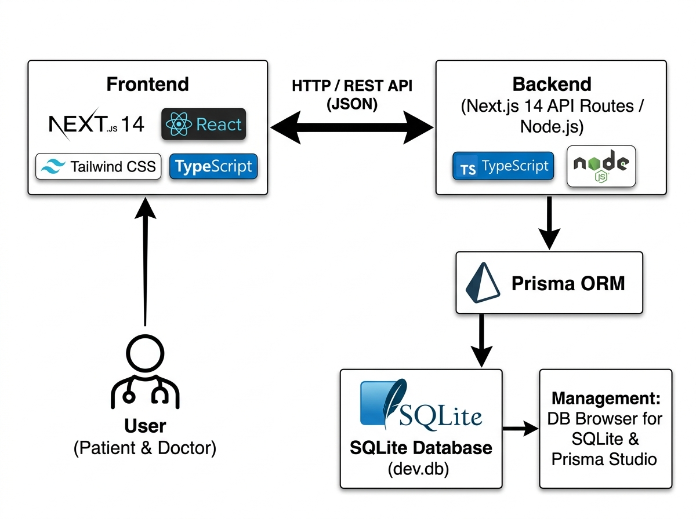

# 🏛️ TÀI LIỆU TỔNG QUAN KIẾN TRÚC HỆ THỐNG & CƠ SỞ DỮ LIỆU
## DỰ ÁN: HỆ THỐNG QUẢN LÝ & ĐẶT LỊCH PHÒNG KHÁM ĐA KHOA CAREPLUS 2026
> **Mã tài liệu:** `KTHT-CAREPLUS-2026`  
> **Phiên bản:** `1.0.0` (Cập nhật tháng 10/2026)  
> **Mục đích:** Cung cấp tài liệu hoàn chỉnh, chuẩn xác để sinh viên học tập, thuyết minh và đưa vào Báo cáo Đồ án Tốt nghiệp / Khóa luận.

---

## 📑 MỤC LỤC
1. [Sơ Đồ Kiến Trúc Hệ Thống Tổng Thể (System Architecture)](#1-sơ-đồ-kiến-trúc-hệ-thống-tổng-thể)
2. [Phân Tích Chi Tiết Từng Tầng Công Nghệ Trong Hệ Thống](#2-phân-tích-chi-tiết-từng-tầng-công-nghệ-trong-hệ-thống)
3. [Bản Chất Cơ Chế Kết Nối CSDL: Next.js Nói Chuyện Với SQLite Như Thế Nào?](#3-bản-chất-cơ-chế-kết-nối-csdl-nextjs-nói-chuyện-với-sqlite-như-thế-nào)
4. [Tổng Quan Về Cơ Sở Dữ Liệu Dự Án (SQLite & Prisma ORM)](#4-tổng-quan-về-cơ-sở-dữ-liệu-dự-án-sqlite--prisma-orm)
5. [Cẩm Nang Quản Trị CSDL Bằng DB Browser for SQLite](#5-cẩm-nang-quản-trị-csdl-bằng-db-browser-for-sqlite)
6. [So Sánh Giải Pháp Quản Trị: DB Browser for SQLite vs. Prisma Studio vs. SSMS](#6-so-sánh-giải-pháp-quản-trị-csdl)
7. [Giải Đáp Các Câu Hỏi Vấn Đáp Thường Gặp Của Hội Đồng Chấm Thi](#7-giải-đáp-các-câu-hỏi-vấn-đáp-thường-gặp)

---

## 1. SƠ ĐỒ KIẾN TRÚC HỆ THỐNG TỔNG THỂ

Sơ đồ thể hiện toàn bộ các tầng công nghệ (Tech Stack) và luồng trao đổi dữ liệu từ Người dùng cuối tới Cơ sở dữ liệu:



### Mô Hình Khối Rút Gọn (Block Diagram):
```
    ┌───────────────────────────┐
    │     NGƯỜI DÙNG (USER)     │ (Bệnh nhân, Bác sĩ, Quản trị viên/Lễ tân)
    └─────────────┬─────────────┘
                  │  (Tương tác qua Trình duyệt Web)
                  ▼
    ┌───────────────────────────┐
    │      TẦNG FRONTEND        │ (Next.js 14 App Router, React 18,
    │     (Giao diện Web)       │  Tailwind CSS, TypeScript, Lucide Icons)
    └─────────────┬─────────────┘
                  │  ▲
   HTTP / REST API│  │ Dữ liệu phản hồi
      (JSON Data) │  │ (Fetch API)
                  ▼  │
    ┌───────────────────────────┐
    │       TẦNG BACKEND        │ (Next.js 14 API Routes, Node.js Runtime,
    │   (Xử lý nghiệp vụ)       │  Bcrypt.js Authentication)
    └─────────────┬─────────────┘
                  │
                  │ Gọi hàm truy vấn hướng đối tượng (Type-safe)
                  ▼
    ┌───────────────────────────┐
    │         TẦNG ORM          │ (Prisma ORM v5.18, Prisma Client,
    │  (Ánh xạ quan hệ thực thể)│  Singleton Connection Pattern)
    └─────────────┬─────────────┘
                  │
                  │ Đọc / Ghi file nhị phân (I/O System Calls)
                  ▼
    ┌───────────────────────────┐         ┌───────────────────────────────┐
    │     TẦNG CƠ SỞ DỮ LIỆU    │ <────── │  CÔNG CỤ QUẢN TRỊ ĐỘC LẬP     │
    │  (SQLite - prisma/dev.db) │         │  • DB Browser for SQLite (GUI)│
    │  Chứa 8 bảng quan hệ chuẩn│         │  • Prisma Studio (Web GUI)    │
    └───────────────────────────┘         └───────────────────────────────┘
```

---

## 2. PHÂN TÍCH CHI TIẾT TỪNG TẦNG CÔNG NGHỆ TRONG HỆ THỐNG

### 2.1. Tầng Giao Diện Người Dùng (Frontend Layer)
* **Next.js 14 (App Router):** 
  - Framework hiện đại hàng đầu cho React, tối ưu hóa quá trình kết xuất giao diện (Server-Side Rendering & Client-Side Rendering).
  - Tự động tối ưu hóa tốc độ tải trang, nạp trước đường dẫn (Route Prefetching) và cấu trúc thư mục dạng module rõ ràng.
* **React 18:** 
  - Thư viện nền tảng xây dựng các thành phần giao diện tái sử dụng (Reusable UI Components), quản lý trạng thái động (Hooks: `useState`, `useEffect`).
* **Tailwind CSS:** 
  - Framework CSS tiện ích (Utility-first CSS) giúp tùy biến giao diện y tế đạt độ thẩm mỹ cao, đồng bộ màu sắc thương hiệu và tương thích hoàn hảo trên mọi kích thước màn hình (Responsive Design).
* **TypeScript:** 
  - Định kiểu dữ liệu tĩnh mạnh mẽ, phát hiện lỗi cú pháp và kiểu dữ liệu ngay trong quá trình biên dịch (Compile-time), triệt tiêu lỗi sập trang (Runtime Crash).

---

### 2.2. Tầng Giao Tiếp (Communication Layer)
* Sử dụng giao thức chuẩn **HTTP / REST API** trao đổi dữ liệu dạng **JSON (JavaScript Object Notation)**.
* **Thay thế cho thư viện cũ (như Axios):** Dự án sử dụng hàm `fetch()` native tích hợp sẵn của Next.js và trình duyệt, giúp mã nguồn gọn nhẹ, không phụ thuộc thư viện bên ngoài và hỗ trợ cơ chế bộ nhớ đệm (Caching / Revalidation) tự động của Next.js.

---

### 2.3. Tầng Xử Lý Nghiệp Vụ Máy Chủ (Backend Layer)
* **Next.js 14 API Routes (`/src/app/api/...`):**
  - Đóng vai trò là máy chủ Backend hoàn chỉnh (thay thế cho việc phải viết máy chủ Express.js riêng biệt).
  - Tiếp nhận các yêu cầu HTTP (`GET`, `POST`, `PUT`, `DELETE`), xử lý logic đặt lịch, xếp ca khám cho bác sĩ, kiểm tra xung đột thời gian và quản lý đơn thuốc.
* **Bcrypt.js:**
  - Thuật toán băm mật khẩu một chiều với độ an toàn cao (`saltRounds = 10`), bảo đảm thông tin tài khoản của bệnh nhân và bác sĩ không bị lộ ngay cả khi file CSDL bị sao chép trái phép.

---

### 2.4. Tầng Ánh Xạ Đối Tượng Thực Thể (ORM Layer - Prisma ORM)
* **Prisma ORM (v5.18):**
  - Đóng vai trò cầu nối thông minh giữa mã nguồn TypeScript và CSDL SQLite (tương tự như `Sequelize` hoặc `Hibernate`).
  - **Lợi ích then chốt:**
    1. Tự động sinh kiểu dữ liệu TypeScript (Type-safe) tương ứng với từng bảng trong CSDL.
    2. Chống tấn công tiêm mã độc SQL (**SQL Injection**) 100% nhờ cơ chế tự động tham số hóa câu truy vấn (Parameterized Queries).
    3. Giúp lập trình viên thao tác với bảng dữ liệu bằng các hàm hướng đối tượng (`prisma.user.findMany()`, `prisma.appointment.create()`) thay vì phải nối chuỗi SQL thủ công.

---

### 2.5. Tầng Cơ Sở Dữ Liệu (Database Layer - SQLite)
* **SQLite 3 (`prisma/dev.db`):**
  - Hệ quản trị CSDL quan hệ nhúng cục bộ (Embedded Relational Database).
  - Toàn bộ dữ liệu được lưu gọn gàng trong tệp tin vật lý duy nhất [prisma/dev.db](file:///d:/PhongKham2026/prisma/dev.db), tuân thủ đầy đủ các nguyên tắc toàn vẹn **ACID**.

---

## 3. BẢN CHẤT CƠ CHẾ KẾT NỐI CSDL: NEXT.JS NÓI CHUYỆN VỚI SQLITE NHƯ THẾ NÀO?

Rất nhiều người thường nhầm lẫn giữa **mô hình CSDL truyền thống (Client-Server)** và **mô hình CSDL nhúng (Embedded File)**:

### 3.1. Sự khác biệt cốt lõi:
| Tiêu Chí | Mô hình SQL Server / MySQL truyền thống | Mô hình SQLite trong dự án Phòng Khám 2026 |
| :--- | :--- | :--- |
| **Hình thức hoạt động** | Máy chủ dịch vụ độc lập chạy nền trên hệ điều hành | Tệp tin nhị phân cục bộ (`dev.db`) nằm trực tiếp trong thư mục dự án |
| **Cổng kết nối mạng** | Bắt buộc mở cổng mạng TCP/IP (VD: `1433`, `3306`) | **Không dùng cổng mạng (Zero Network Overhead)** |
| **Xác thực kết nối** | Cần IP máy chủ, Port, Username (`sa`), Password | Chỉ cần đường dẫn tệp tin: `file:./dev.db` |
| **Tốc độ đọc/ghi** | Mất thời gian bắt tay TCP mạng và truyền gói tin | Đọc ghi trực tiếp trên đĩa cứng qua I/O Kernel (< 1 mili-giây) |

---

### 3.2. Đường đi của một truy vấn dữ liệu từ A ➔ Z:

Ví dụ khi Bệnh nhân truy cập trang danh sách Chuyên khoa:

```
[1. TRÌNH DUYỆT WEB]
       │
       │ Gửi HTTP GET: /api/specialties
       ▼
[2. BACKEND API ROUTE] (src/app/api/specialties/route.ts)
       │
       │ Code thực thi: const data = await prisma.specialty.findMany();
       ▼
[3. PRISMA CLIENT SINGLETON] (src/database/prisma.ts)
       │
       │ Tự động biên dịch hàm findMany() sang câu lệnh SQL chuẩn:
       │ "SELECT id, name, description, iconUrl FROM Specialty ORDER BY name ASC;"
       ▼
[4. PRISMA QUERY ENGINE (Thư viện C++ / Rust nhúng)]
       │
       │ Dùng lệnh hệ điều hành Windows mở tệp: D:\PhongKham2026\prisma\dev.db
       ▼
[5. TỆP VẬT LÝ dev.db]
       │
       │ Quét trang dữ liệu (B-Tree Data Pages), trả lại bản ghi
       ▼
[6. KẾT QUẢ ĐÓNG GÓI JSON]
       │
       │ Trả về Frontend render ra thẻ chuyên khoa trên màn hình!
```

---

### 3.3. File Code Quản Lý Kết Nối Trong Dự Án:
Tại file [src/database/prisma.ts](file:///d:/PhongKham2026/src/database/prisma.ts), dự án áp dụng **Singleton Pattern**:
```typescript
import { PrismaClient } from '@prisma/client';

const globalForPrisma = globalThis as unknown as {
  prisma: PrismaClient | undefined;
};

// Đảm bảo toàn dự án chỉ tồn tại 1 kết nối duy nhất, tránh lỗi cạn kiệt kết nối hay File Lock
export const prisma = globalForPrisma.prisma ?? new PrismaClient();

if (process.env.NODE_ENV !== 'production') globalForPrisma.prisma = prisma;
export default prisma;
```

---

## 4. TỔNG QUAN VỀ CƠ SỞ DỮ LIỆU DỰ ÁN (SQLITE & PRISMA ORM)

Cơ sở dữ liệu phòng khám bao gồm **8 bảng dữ liệu quan hệ** được định nghĩa tại [prisma/schema.prisma](file:///d:/PhongKham2026/prisma/schema.prisma):

```
       ┌────────────────────────┐                   ┌────────────────────────┐
       │         User           │                   │       Specialty        │
       │  (Admin, Doctor, Pat)  │                   │ (10 Chuyên Khoa Y Tế)  │
       └───────────┬────────────┘                   └───────────┬────────────┘
                   │                                            │
        1:1        │ 1:N                                        │ 1:N
        ┌──────────┴──────────┐                                 │
        ▼                     ▼                                 ▼
 ┌───────────────┐     ┌──────────────────────────────────────────────────┐
 │  DoctorInfo   │     │                   Appointment                    │
 │ (Học vị, phí) │ <── │          (Phiếu Đăng Ký Lịch Hẹn Khám)           │
 └───────┬───────┘     └────────────────────────┬─────────────────────────┘
         │                                      │
     1:N │                                  1:1 │
         ▼                                      ▼
 ┌────────────────┐                     ┌────────────────┐
 │ DoctorSchedule │                     │ MedicalRecord  │
 │ (Lịch trực tuần│                     │(Bệnh Án ĐT)    │
 └────────────────┘                     └───────┬────────┘
                                                │ 1:N
                                                ▼
                                        ┌────────────────┐
                                        │  Prescription  │
                                        │  (Đơn Thuốc)   │
                                        └────────────────┘
```

1. **`User`:** Tài khoản người dùng toàn hệ thống (`role`: `ADMIN`, `DOCTOR`, `PATIENT`).
2. **`Specialty`:** Danh mục 10 Chuyên khoa y tế (Khoa Tim Mạch, Khoa Nhi, Khoa Mắt, Tai Mũi Họng,...).
3. **`DoctorInfo`:** Thông tin chuyên môn mở rộng của bác sĩ (quan hệ $1:1$ với `User`).
4. **`DoctorSchedule`:** Ma trận ca trực định kỳ trong tuần của từng bác sĩ (Chủ nhật ➔ Thứ 7).
5. **`Appointment`:** Quản lý vòng đời lịch hẹn (`PENDING` ➔ `CONFIRMED` ➔ `COMPLETED` / `CANCELLED`).
6. **`MedicalRecord`:** Hồ sơ bệnh án lâm sàng do bác sĩ lập sau khi khám bệnh.
7. **`Prescription`:** Chi tiết các loại thuốc được kê trong đơn thuốc điện tử.
8. **`Notification`:** Hệ thống cảnh báo và phát thông báo điều phối lịch khám cho bệnh nhân/lễ tân.

---

## 5. CẨM NANG QUẢN TRỊ CSDL BẰNG DB BROWSER FOR SQLITE

**DB Browser for SQLite (DB4S)** là phần mềm máy tính nguồn mở giúp lập trình viên quản trị, duyệt và thao tác trực tiếp với file [prisma/dev.db](file:///d:/PhongKham2026/prisma/dev.db).

### 5.1. Ba Tab Chức Năng Cốt Lõi:
1. **`Database Structure` (Xem cấu trúc):** Hiển thị lược đồ 8 bảng, danh sách các cột, khóa chính (`PK`), khóa ngoại (`FK`) và chỉ mục (`Indexes`).
2. **`Browse Data` (Biên tập trực quan):**
   - Xem dữ liệu dạng bảng tính Excel.
   - Sửa ô: Nhấp đúp chuột vào ô cần sửa, gõ nội dung mới và bấm *Apply*.
   - Thêm dòng: Bấm nút **New Record**.
   - Xóa dòng: Bấm nút **Delete Record**.
   - Lọc nhanh: Gõ từ khóa vào ô tìm kiếm ngay dưới tiêu đề cột (VD: gõ `PATIENT` dưới cột `role`).
3. **`Execute SQL` (Thực thi câu lệnh SQL):**
   - Khung trên: Soạn thảo câu lệnh SQL thuần (`SELECT`, `INSERT`, `UPDATE`, `DELETE`).
   - Phím tắt thực thi: Bấm **F5** hoặc nút **Play (▶️)** màu xanh.
   - Khung dưới: Hiển thị bảng kết quả truy vấn và thời gian thực thi (Execution Time).

---

### 5.2. Quy Tắc Vàng Khi Dùng DB4S: Giao Dịch An Toàn (Write / Revert Changes)
* Mọi thao tác thêm/sửa/xóa trên DB4S lúc đầu chỉ được lưu tạm thời trên bộ nhớ **RAM**.
* **Bắt buộc bấm nút "Write Changes" (Ctrl + S):** Dữ liệu mới thực sự ghi vĩnh viễn xuống tệp `dev.db` để website Next.js nhận được.
* **Bấm "Revert Changes":** Hủy bỏ các thao tác sửa đổi nếu lỡ tay làm sai, khôi phục lại dữ liệu ban đầu an toàn.

---

### 5.3. Các Câu Lệnh SQL Tiêu Biểu Trong Dự Án:
```sql
-- 1. Truy vấn danh sách toàn bộ Bệnh nhân
SELECT id, fullName, email, phone FROM User WHERE role = 'PATIENT';

-- 2. Tìm kiếm Bệnh nhân theo tên cụ thể
SELECT fullName, phone, email FROM User WHERE role = 'PATIENT' AND fullName LIKE '%Trang%';

-- 3. Xem danh sách lịch hẹn khám kèm tên Bệnh nhân và Chuyên khoa (Phép JOIN)
SELECT a.id, u.fullName AS benhNhan, s.name AS chuyenKhoa, a.appointmentDate, a.status
FROM Appointment a
JOIN User u ON a.patientId = u.id
JOIN Specialty s ON a.specialtyId = s.id;

-- 4. Cập nhật duyệt lịch hẹn bằng tay
UPDATE Appointment SET status = 'CONFIRMED' WHERE id = 'ma-id-lich-hen';

-- 5. Xóa lịch hẹn bị hủy
DELETE FROM Appointment WHERE status = 'CANCELLED';
```

---

## 6. SO SÁNH GIẢI PHÁP QUẢN TRỊ CSDL

| Tiêu Chí So Sánh | DB Browser for SQLite | Prisma Studio | SQL Server Management Studio (SSMS) |
| :--- | :--- | :--- | :--- |
| **Loại ứng dụng** | Native Desktop (C++/Qt) | Web GUI (Chạy trên cổng `5555`) | Enterprise Desktop Suite |
| **Tương thích dự án** | **Hoàn hảo 100%** (Mở trực tiếp `dev.db`) | **Hoàn hảo 100%** (Tích hợp Prisma) | **Không tương thích** (Chỉ dành cho MS SQL Server) |
| **Hỗ trợ gõ lệnh SQL** | ⭐⭐⭐⭐⭐ (Có tab Execute SQL riêng) | ❌ Không hỗ trợ (Chỉ có bộ lọc Filter) | ⭐⭐⭐⭐⭐ (Rất mạnh) |
| **Duyệt quan hệ liên bảng**| Thủ công qua câu lệnh `JOIN` | ⭐⭐⭐⭐⭐ (Click 1 chạm xem bảng liên kết) | Thủ công qua câu lệnh `JOIN` |
| **Độ nặng máy & Cài đặt** | Siêu nhẹ (~20MB), có bản Portable | Chạy ngay bằng lệnh `npm run db:studio` | Rất nặng (~2GB), cần cài đặt SQL Server Service |
| **Vai trò khuyên dùng** | **Dùng gõ SQL, kiểm tra bảng & xuất báo cáo** | **Dùng test nhanh luồng Web & demo giao diện** | Dự án doanh nghiệp thuần Microsoft Stack |

---

## 7. GIẢI ĐÁP CÁC CÂU HỎI VẤN ĐÁP THƯỜNG GẶP

### Câu 1: Tại sao file `prisma/dev.db` khi bấm vào trong VS Code lại báo lỗi "unsupported text encoding / binary"?
> **Trả lời:** Vì `dev.db` là một tệp cơ sở dữ liệu nhị phân (Binary SQLite B-Tree Format), không phải tệp văn bản mã nguồn thông thường (như `.ts`, `.json`). Để xem được nội dung bảng, lập trình viên phải mở tệp này bằng các công cụ chuyên dụng như **DB Browser for SQLite** hoặc chạy lệnh **`npm run db:studio`**.

### Câu 2: Tại sao dự án chọn SQLite thay vì SQL Server / MySQL?
> **Trả lời:** 
> 1. SQLite là CSDL nhúng serverless, không cần cài đặt dịch vụ nền hay mở cổng mạng, giúp mã nguồn dự án mang tính di động cao (nén thư mục gửi cho thầy cô hoặc mang sang máy khác là web chạy được ngay lập tức).
> 2. Nhờ sử dụng tầng trung gian **Prisma ORM**, khi hệ thống mở rộng quy mô lên Production, nhóm chỉ cần thay đổi dòng khai báo `provider = "postgresql"` trong file `schema.prisma` và đổi chuỗi kết nối Cloud là toàn bộ mã nguồn vẫn hoạt động trơn tru mà không cần viết lại câu lệnh truy vấn nào.

### Câu 3: DB Browser for SQLite có vẽ được sơ đồ ERD không? Dự án giải quyết việc vẽ ERD thế nào?
> **Trả lời:** DB Browser for SQLite không tích hợp công cụ vẽ ERD đồ họa. Nhóm đã thiết kế sẵn tài liệu chuẩn hóa [`ERD_DESIGN.md`](file:///d:/PhongKham2026/ERD_DESIGN.md) sử dụng cú pháp **Mermaid (Crow's Foot Notation)**. Khi cần trích xuất sơ đồ để nộp báo cáo, nhóm chỉ cần sao chép mã nguồn dán vào [mermaid.live](https://mermaid.live/) hoặc sử dụng phần mềm **DBeaver** kết nối vào `dev.db` để xuất ảnh sắc nét.

---
*Tài liệu được lưu trữ tại:* [`d:\PhongKham2026\KTHT.md`](file:///d:/PhongKham2026/KTHT.md)  
*Ảnh sơ đồ kiến trúc đính kèm:* [`d:\PhongKham2026\system_architecture.jpg`](file:///d:/PhongKham2026/system_architecture.jpg)
