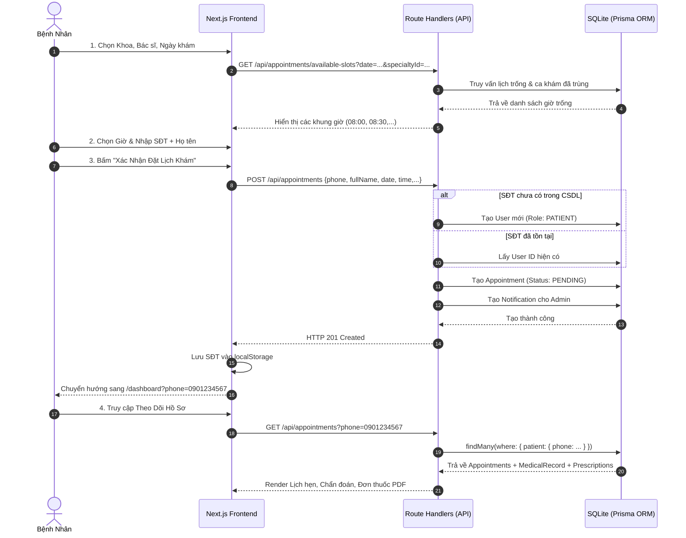

# PHÂN TÍCH CHI TIẾT HỆ THỐNG DÀNH CHO BỆNH NHÂN (PATIENT SYSTEM)
## PHÒNG KHÁM ĐA KHOA CAREPLUS+

---

## MỤC LỤC
1. [Tổng Quan Phân Hệ Bệnh Nhân](#1-tổng-quan-phân-hệ-bệnh-nhân)
2. [Các Công Nghệ Được Sử Dụng](#2-các-công-nghệ-được-sử-dụng)
3. [Kiến Trúc & Mô Hình Dữ Liệu Liên Quan](#3-kiến-trúc--mô-hình-dữ-liệu-liên-quan)
4. [Toàn Bộ Vòng Đời & Trải Nghiệm Của Bệnh Nhân (End-to-End Patient Journey)](#4-toàn-bộ-vòng-đời--trải-nghiệm-của-bệnh-nhân)
   - [Giai Đoạn 1: Tiếp cận & Tìm hiểu thông tin (Chưa đặt lịch)](#giai-đoạn-1-tiếp-cận--tìm-hiểu-thông-tin)
   - [Giai Đoạn 2: Quy trình Đặt lịch khám bệnh 3 bước](#giai-đoạn-2-quy-trình-đặt-lịch-khám-bệnh-3-bước)
   - [Giai Đoạn 3: Tra cứu & Theo dõi hồ sơ bằng Số Điện Thoại](#giai-đoạn-3-tra-cứu--theo-dõi-hồ-sơ-bằng-số-điện-thoại)
   - [Giai Đoạn 4: Đăng ký, Đăng nhập & Cơ chế cấp mật khẩu cho Khách vãng lai](#giai-đoạn-4-đăng-ký-đăng-nhập--cơ-chế-cấp-mật-khẩu-cho-khách-vãng-lai)
   - [Giai Đoạn 5: Quản lý thông tin cá nhân & Tải ảnh đại diện](#giai-đoạn-5-quản-lý-thông-tin-cá-nhân--tải-ảnh-đại-diện)
   - [Giai Đoạn 6: Khôi phục mật khẩu qua mã OTP SMS](#giai-đoạn-6-khôi-phục-mật-khẩu-qua-mã-otp-sms)
5. [Sơ Đồ Luồng Dữ Liệu (Data Flow & Sequence Diagrams)](#5-sơ-đồ-luồng-dữ-liệu)
6. [Danh Sách Các Endpoint API Phục Vụ Bệnh Nhân](#6-danh-sách-các-endpoint-api-phục-vụ-bệnh-nhân)
7. [Các Điểm Nhấn Về Trải Nghiệm Người Dùng (UX/UI Highlights)](#7-các-điểm-nhấn-về-trải-nghiệm-người-dùng)

---

## 1. TỔNG QUAN PHÂN HỆ BỆNH NHÂN

Phân hệ **Bệnh nhân (Patient System)** của phòng khám CarePlus+ được thiết kế với triết lý **"Phone-First & Frictionless" (Lấy Số Điện Thoại làm trọng tâm & Tối giản rào cản thao tác)**:
- Người dùng lần đầu có thể đặt lịch khám ngay mà **không bắt buộc phải đăng ký tài khoản trước**.
- **Số Điện Thoại (SĐT)** được sử dụng làm mã định danh duy nhất xuyên suốt: từ đặt khám, tra cứu hồ sơ không cần mật khẩu, đến đăng ký / đăng nhập tài khoản chính thức.
- Bệnh nhân có thể theo dõi tiến độ xếp lịch, bác sĩ phụ trách, xem kết quả chẩn đoán và **in đơn thuốc điện tử PDF** trực tiếp trên mọi thiết bị (máy tính, máy tính bảng, điện thoại di động).

---

## 2. CÁC CÔNG NGHỆ ĐƯỢC SỬ DỤNG

| Công nghệ / Thư viện | Phiên bản / Vai trò | Mục đích & Ứng dụng trong phân hệ Bệnh nhân |
| :--- | :--- | :--- |
| **Next.js (App Router)** | `v14.2+` | Framework full-stack chính. Xử lý Server Components (tải trước dữ liệu bác sĩ, chuyên khoa), Client Components (tương tác đặt lịch, chọn khung giờ, đổi tab hồ sơ) và Next.js API Route Handlers. |
| **TypeScript** | `v5.x` | Đảm bảo tính chặt chẽ về mặt kiểu dữ liệu (`Appointment`, `MedicalRecord`, `Prescription`, `UserSession`) từ Frontend đến Database. |
| **TailwindCSS** | `v3.4+` | Xây dựng giao diện y tế cao cấp, thiết kế responsive đa nền tảng, hệ màu phân tầng trực quan (Xanh ngọc Mint & Emerald cho Chuyên khoa, Xanh Ocean Sky cho Bác sĩ). |
| **Prisma ORM** | `v5.x` | Công cụ tương tác CSDL kiểu mẫu (Object-Relational Mapping), tự động sinh truy vấn tối ưu và quản lý quan hệ bảng (Relations). |
| **SQLite (dev.db)** | CSDL quan hệ | Lưu trữ cục bộ toàn bộ người dùng, lịch hẹn, hồ sơ bệnh án, đơn thuốc, lịch trực và thông báo. |
| **React Hook Form & Zod** | `v7.x` & `v3.x` | Quản lý form đặt lịch, đăng ký, đăng nhập. Kiểm tra tính hợp lệ dữ liệu (validate SĐT 10 số, ngày khám không ở quá khứ, mật khẩu an toàn). |
| **Bcrypt.js** | `v2.4+` | Mã hóa mật khẩu bảo mật một chiều (Salt Rounds = 10) trước khi lưu vào CSDL. |
| **Lucide React** | `v0.4+` | Bộ icon SVG vector y tế sắc nét (`Stethoscope`, `HeartPulse`, `Calendar`, `Pill`, `Phone`, `Upload`, `Printer`...). |
| **Sonner** | `v1.x` | Hiển thị thông báo trạng thái dạng Toast Notification hiện đại, mượt mà và trực quan. |
| **FileReader API (HTML5)** | Web API chuẩn | Chuyển đổi tệp ảnh đại diện (avatar) từ máy tính sang chuẩn Base64 Data URL để xem trước tức thì và lưu trữ trực tiếp. |
| **HTTP-Only Cookies** | Session Management | Lưu trữ phiên làm việc của người dùng an toàn, chống tấn công XSS. |

---

## 3. KIẾN TRÚC & MÔ HÌNH DỮ LIỆU LIÊN QUAN

```
                   +-----------------------------------------------+
                   |                  User (Cơ sở)                 |
                   |  id, fullName, phone, email, passwordHash,... |
                   +-----------------------------------------------+
                                          |
                   +----------------------+-----------------------+
                   | 1-N                                          | 1-N
                   v                                              v
      +-------------------------+                    +-------------------------+
      |       Appointment       | 1-1                |      MedicalRecord      |
      | id, patientId, doctorId |------------------->| id, appointmentId       |
      | specialtyId, date, time |                    | symptoms, diagnosis     |
      | status, bookingType     |                    +-------------------------+
      +-------------------------+                                 | 1-N
                                                                  v
                                                     +-------------------------+
                                                     |       Prescription      |
                                                     | medicineName, dosage    |
                                                     | frequency, duration     |
                                                     +-------------------------+
```

### Các trạng thái của Lịch Hẹn (`Appointment.status`):
- `PENDING`: Lịch hẹn mới tạo, đang chờ Lễ tân / Quản lý kiểm tra và xác nhận.
- `CONFIRMED`: Đã được duyệt, bác sĩ đã sẵn sàng tiếp nhận khám.
- `NEEDS_REASSIGNMENT`: Bác sĩ báo bận đột xuất, cần hệ thống hoặc quản lý điều phối bác sĩ khác.
- `COMPLETED`: Bệnh nhân đã khám xong, bác sĩ đã nhập hồ sơ bệnh án và đơn thuốc.
- `CANCELLED`: Lịch hẹn đã bị bệnh nhân hoặc phòng khám hủy.

---

## 4. TOÀN BỘ VÒNG ĐỜI & TRẢI NGHIỆM CỦA BỆNH NHÂN

### Giai Đoạn 1: Tiếp Cận & Tìm Hiểu Thông Tin
1. **Truy cập Trang chủ (`/`):**
   - Header hiển thị nhận diện thương hiệu **Phòng Khám CarePlus+** với slogan *"Chăm sóc sức khỏe uy tín"*.
   - Người dùng duyệt danh mục **Quy trình 3 bước**, **Chuyên Khoa Y Tế Nổi Bật** (Khoa Tim mạch, Khoa Nhi, Da liễu, Nội khoa...) và danh sách **Bác Sĩ Giỏi & Tận Tâm** (kèm bằng cấp, số năm kinh nghiệm, giá khám).
2. **Khởi tạo đặt lịch:**
   - Người dùng có thể bấm nút *"Đặt Khám Ngay"* trên Header, bấm *"Đặt lịch khoa này"* tại thẻ chuyên khoa, hoặc bấm *"Đặt Khám"* tại thẻ của từng bác sĩ.

---

### Giai Đoạn 2: Quy Trình Đặt Lịch Khám Bệnh 3 Bước (`/book`)

Quy trình được chia làm 3 bước rõ ràng qua bộ chỉ báo tiến trình trực quan:

```
[1. Chọn Khoa & Bác Sĩ] ---> [2. Chọn Ngày & Giờ] ---> [3. Thông Tin SĐT & Xác Nhận]
```

#### Bước 1: Chọn Chuyên Khoa & Bác Sĩ
- Người dùng chọn chuyên khoa phù hợp (Khoa Tim Mạch, Khoa Nhi...).
- Lựa chọn hình thức xếp bác sĩ:
  - **Hệ thống tự động xếp (Mặc định):** Phòng khám sẽ tự động sắp xếp bác sĩ giỏi đang trống lịch.
  - **Tự chọn bác sĩ cụ thể:** Hiển thị danh sách bác sĩ thuộc khoa đó kèm ảnh đại diện, học hàm/học vị và chi phí khám để người dùng lựa chọn.

#### Bước 2: Chọn Ngày & Giờ Khám
- Bệnh nhân chọn ngày khám (hệ thống tự động chặn các ngày trong quá khứ).
- Khi ngày và khoa được chọn, hệ thống gọi API `GET /api/appointments/available-slots`:
  - Kiểm tra lịch làm việc của bác sĩ (`DoctorSchedule`).
  - Lọc trừ các khung giờ đã có bệnh nhân khác đặt hoặc bác sĩ báo bận.
  - Hiển thị danh sách các **khung giờ còn trống** (ví dụ: `08:00`, `08:30`, `09:00`, `14:00`...).

#### Bước 3: Điền Thông Tin Cá Nhân (Ưu tiên Số Điện Thoại)
- **Số Điện Thoại (10 số):** Được làm nổi bật với thông báo xác nhận: *"Số điện thoại là mã định danh chính của bạn để tra cứu lịch hẹn và hồ sơ bệnh án trực tuyến mà không cần nhớ mật khẩu phức tạp."*
- **Họ và Tên bệnh nhân:** Nhập họ tên đầy đủ.
- **Email liên hệ:** Không bắt buộc (tùy chọn nếu người dùng muốn nhận thêm thông báo qua email).
- **Mô tả triệu chứng:** Ghi chú lý do khám hoặc triệu chứng ban đầu.
- Bảng tóm tắt toàn bộ phiếu đặt lịch xuất hiện trực tiếp trước khi bấm *"Xác Nhận Đặt Lịch Khám"*.

#### Xử lý tại Backend (`POST /api/appointments`):
1. Kiểm tra trong CSDL: Tìm người dùng đã có sẵn theo `phone`.
2. Nếu chưa có: Tự động khởi tạo một tài khoản Bệnh nhân mới (`role: PATIENT`) gắn với SĐT đó.
3. Tạo bản ghi `Appointment` với trạng thái `PENDING`.
4. Tạo bản ghi `Notification` gửi đến Quản lý / Lễ tân phòng khám thông báo có ca khám mới.
5. Lưu SĐT vào `localStorage` của trình duyệt (`careplus_patient_phone`).
6. Chuyển hướng ngay người dùng sang trang Theo Dõi Hồ Sơ: `/dashboard?phone=0901234567`.

---

### Giai Đoạn 3: Tra Cứu & Theo Dõi Hồ Sơ Bằng Số Điện Thoại (`/dashboard`)

Hệ thống hỗ trợ 2 cơ chế theo dõi linh hoạt:

#### 1. Dành cho Khách vãng lai (Chưa đăng nhập)
- Khi truy cập `/dashboard`, nếu người dùng chưa đăng nhập:
  - Hệ thống tự động kiểm tra `phone` từ URL query hoặc từ lần đặt lịch gần nhất trong `localStorage`.
  - Nếu có SĐT: Tự động tải toàn bộ lịch sử ca khám mà **không cần đăng nhập**.
  - Nếu chưa có: Hiển thị thanh tra cứu nhanh màu xanh sang trọng: Người dùng chỉ cần nhập Số Điện Thoại -> Bấm *"Tra Cứu"* -> Hệ thống tải toàn bộ dữ liệu.

#### 2. Dành cho Bệnh nhân đã đăng nhập
- Tự động ẩn thanh tìm kiếm (vì hệ thống đã định danh chính chủ).
- Hiển thị trực tiếp thông tin bệnh nhân, số lượt khám, và danh mục quản lý hồ sơ.

#### Nội dung hiển thị trên 3 Tab theo dõi:
- **Tab 1 — Lịch Hẹn Khám:**
  - Hiển thị trạng thái (Đang chờ xác nhận / Đã duyệt / Cần đổi bác sĩ).
  - Tên bác sĩ phụ trách, chuyên khoa, ngày khám, khung giờ khám.
  - Nút **"Hủy Lịch Hẹn"** nếu bệnh nhân có việc bận đột xuất.
- **Tab 2 — Lịch Sử & Chẩn Đoán:**
  - Hiển thị các ca khám đã hoàn thành.
  - Kết quả chẩn đoán y khoa, triệu chứng lâm sàng và lời khuyên của bác sĩ.
  - Nút *"Xem Đơn Thuốc"* mở nhanh danh mục thuốc đã kê.
- **Tab 3 — Đơn Thuốc Điện Tử:**
  - Hiển thị danh mục từng loại thuốc (Tên thuốc, hàm lượng, cách dùng, thời gian uống).
  - Nút **"In Đơn Thuốc PDF"**: Mở cửa sổ in ấn phiếu khám & toa thuốc chuẩn phòng khám CarePlus+.

---

### Giai Đoạn 4: Đăng Ký, Đăng Nhập & Cơ Chế Cấp Mật Khẩu Cho Khách Vãng Lai

#### 1. Khách Vãng Lai Tra Cứu Lại Hồ Sơ KHÔNG CẦN MẬT KHẨU:
- **Tự động ghi nhớ trên cùng thiết bị:** Khi khách vãng lai đặt lịch thành công, SĐT được lưu trong `localStorage` (`careplus_patient_phone`). Khi quay lại trang `/dashboard` trên cùng trình duyệt, hệ thống tự động tải toàn bộ lịch sử ca khám mà không yêu cầu đăng nhập.
- **Truy cập từ thiết bị khác (Điện thoại mới, máy tính khác):** Bệnh nhân chỉ cần mở trang **"Theo Dõi Hồ Sơ"** (`/dashboard`), nhập **Số Điện Thoại** đã đặt lịch vào thanh tra cứu trên đầu trang -> Bấm *"Tra Cứu"* là xem được đầy đủ hồ sơ bệnh án, lịch hẹn và đơn thuốc điện tử ngay lập tức mà không cần nhớ mật khẩu.

#### 2. Làm Thế Nào Để Khách Vãng Lai Có MẬT KHẨU Để Đăng Nhập Chính Thức?
Khi khách vãng lai muốn đăng nhập chính thức (để đổi Avatar, quản lý thông tin cá nhân, cập nhật mật khẩu riêng), họ có thể lấy/tạo mật khẩu theo các cách sau:

* **🔹 Cách 1: Tự tạo mật khẩu mới bằng mã OTP SMS (Khuyên dùng - Trải nghiệm chuẩn nhất):**
  1. Khách vào trang **Đăng Nhập** (`/login`) -> Bấm vào dòng chữ **"Quên mật khẩu?"**.
  2. Nhập **Số Điện Thoại** đã dùng khi đặt lịch khám -> Bấm *"Gửi Mã Xác Thực OTP"*.
  3. Hệ thống tạo mã OTP 6 chữ số gửi về điện thoại của bệnh nhân.
  4. Bệnh nhân nhập mã OTP nhận được + **Mật khẩu mới tự chọn** (tối thiểu 6 ký tự) -> Bấm *"Xác Nhận Đổi Mật Khẩu"*.
  5. Sau bước này, tài khoản của bệnh nhân đã có mật khẩu riêng an toàn và có thể đăng nhập bình thường.

* **🔹 Cách 2: Sử dụng mật khẩu khởi tạo mặc định của hệ thống:**
  - Khi khách vãng lai đặt lịch lần đầu, backend (`POST /api/appointments`) tự động khởi tạo tài khoản bệnh nhân (`role: PATIENT`) gắn với SĐT và cấp mật khẩu mã hóa mặc định:
    ```text
    password123
    ```
  - Bệnh nhân có thể dùng **SĐT của mình** + mật khẩu **`password123`** để đăng nhập ngay tại `/login`. Sau khi đăng nhập, bệnh nhân vào Tab **"Quản Lý Cá Nhân"** trên Dashboard để đổi sang mật khẩu riêng.

* **🔹 Cách 3: Khi khách bấm vào trang Đăng Ký (`/register`):**
  - Nếu khách nhập lại SĐT đã từng đặt lịch để đăng ký tài khoản mới, hệ thống sẽ phát hiện SĐT đã tồn tại và thông báo hướng dẫn chuyển sang Đăng Nhập hoặc Đặt lại mật khẩu bằng mã OTP.

#### 3. Đăng Ký Tài Khoản Mới (`/register`):
- Biểu mẫu cực kỳ tối giản, **loại bỏ trường Email**:
  1. Họ và tên bệnh nhân
  2. Số Điện Thoại (10 số)
  3. Mật khẩu & Xác nhận mật khẩu
- Sau khi bấm *"Đăng Ký Bằng Số Điện Thoại"*, hệ thống mã hóa mật khẩu qua Bcrypt, khởi tạo tài khoản và tự động cấp Session Cookie để bệnh nhân vào thẳng Dashboard.

#### 4. Đăng Nhập Tài Khoản (`/login`):
- Bệnh nhân chỉ cần nhập **Số Điện Thoại** và **Mật khẩu**.
- Hỗ trợ nút đăng nhập nhanh trải nghiệm Demo cho Bệnh nhân (`0901234567`), Bác sĩ (`0912345601`) và Quản lý (`0909000001`).

---

### Giai Đoạn 5: Quản Lý Thông Tin Cá Nhân & Tải Ảnh Đại Diện

Khi bệnh nhân đã đăng nhập, Tab **"Quản Lý Cá Nhân"** trên Dashboard cho phép:
1. **Thay đổi ảnh đại diện (Avatar):**
   - **Tải ảnh từ máy tính:** Bấm nút *"Tải Ảnh Từ Máy Tính"* hoặc bấm trực tiếp vào ảnh đại diện để chọn ảnh từ thiết bị (hỗ trợ JPG, PNG, WEBP tối đa 5MB). FileReader API sẽ nạp ảnh tức thì.
   - **Chọn Avatar mẫu:** Bộ sưu tập 8 hình đại diện sẵn có chỉ với 1 click.
   - **Dán Link ảnh:** Nhập đường dẫn ảnh từ internet.
2. **Chỉnh sửa thông tin cá nhân:** Đổi họ tên, số điện thoại hoặc email.
3. **Đổi mật khẩu tài khoản:** Nhập mật khẩu hiện tại và đặt mật khẩu mới an toàn.
4. **Lưu cập nhật:** Gọi API `PUT /api/auth/profile`, tự động cập nhật cơ sở dữ liệu và làm mới phiên làm việc.

---

### Giai Đoạn 6: Khôi Phục Mật Khẩu Qua Mã OTP SMS

Nếu bệnh nhân quên mật khẩu:
1. Tại trang Đăng Nhập, bấm vào dòng **"Quên mật khẩu?"**.
2. **Bước 1:** Nhập Số Điện Thoại đã đăng ký -> Bấm *"Gửi Mã Xác Thực OTP"*. Hệ thống sinh mã OTP 6 chữ số (`POST /api/auth/forgot-password`).
3. **Bước 2:** Nhập mã OTP nhận được + Mật khẩu mới -> Bấm *"Xác Nhận Đổi Mật Khẩu"* (`POST /api/auth/reset-password`).
4. Hệ thống cập nhật mật khẩu mới và điền sẵn thông tin để người dùng đăng nhập ngay lập tức.

---

## 5. SƠ ĐỒ LUỒNG DỮ LIỆU

### Sơ Đồ Quy Trình Đặt Lịch & Tra Cứu (Sequence Diagram)



---

## 6. DANH SÁCH CÁC ENDPOINT API PHỤC VỤ BỆNH NHÂN

| Phương thức | Đường dẫn Endpoint | Chức năng chi tiết |
| :--- | :--- | :--- |
| `GET` | `/api/specialties` | Lấy danh sách chuyên khoa khám bệnh |
| `GET` | `/api/doctors?specialtyId=...` | Lấy danh sách bác sĩ (lọc theo khoa hoặc tất cả) |
| `GET` | `/api/appointments/available-slots` | Tính toán và trả về các khung giờ khám còn trống theo ngày & bác sĩ |
| `POST` | `/api/appointments` | Đặt lịch khám mới (Tự động liên kết / tạo bệnh nhân theo SĐT) |
| `GET` | `/api/appointments?phone=...` | Tra cứu toàn bộ lịch hẹn & hồ sơ bệnh án theo Số Điện Thoại |
| `GET` | `/api/appointments?patientId=...` | Lấy danh sách ca khám của bệnh nhân đã đăng nhập |
| `POST` | `/api/auth/login` | Đăng nhập tài khoản bằng Số Điện Thoại và Mật Khẩu |
| `POST` | `/api/auth/register` | Đăng ký tài khoản bệnh nhân mới bằng Số Điện Thoại |
| `POST` | `/api/auth/forgot-password` | Gửi mã OTP xác thực khôi phục mật khẩu về Số Điện Thoại |
| `POST` | `/api/auth/reset-password` | Xác thực mã OTP và cập nhật mật khẩu mới |
| `PUT` | `/api/auth/profile` | Chỉnh sửa thông tin cá nhân, cập nhật Avatar và đổi mật khẩu |
| `GET` | `/api/auth/me` | Lấy thông tin phiên làm việc hiện tại từ Session Cookie |
| `POST` | `/api/auth/logout` | Đăng xuất tài khoản và xóa Cookie phiên làm việc |

---

## 7. CÁC ĐIỂM NHẤN VỀ TRẢI NGHIỆM NGƯỜI DÙNG (UX/UI HIGHLIGHTS)

1. **Không Rào Cản (Zero-Friction Booking):** Bệnh nhân không cần tạo tài khoản hay ghi nhớ email mà vẫn hoàn tất đặt lịch khám trong chưa đầy 60 giây.
2. **Số Điện Thoại Đa Năng:** Vừa là tên đăng nhập, vừa là mã tra cứu hồ sơ trực tuyến, vừa là số nhận thông báo lịch hẹn.
3. **Phân Tầng Màu Sắc Trực Quan:** Tông màu Xanh Ngọc Y Tế (*Mint & Emerald*) cho Chuyên khoa khám và Xanh Biển (*Ocean Sky*) cho Đội ngũ Bác sĩ giúp bệnh nhân phân biệt danh mục dễ dàng.
4. **Đơn Thuốc Điện Tử Chuẩn In Ấn:** Định dạng đơn thuốc hiển thị đầy đủ thông tin phòng khám CarePlus+, bác sĩ kê đơn, danh mục thuốc, liều dùng và sẵn sàng xuất bản in PDF.
5. **Cá Nhân Hóa Toàn Diện:** Bệnh nhân dễ dàng tải ảnh đại diện từ máy tính hoặc lựa chọn các avatar mẫu đẹp mắt để hoàn thiện hồ sơ của mình.
