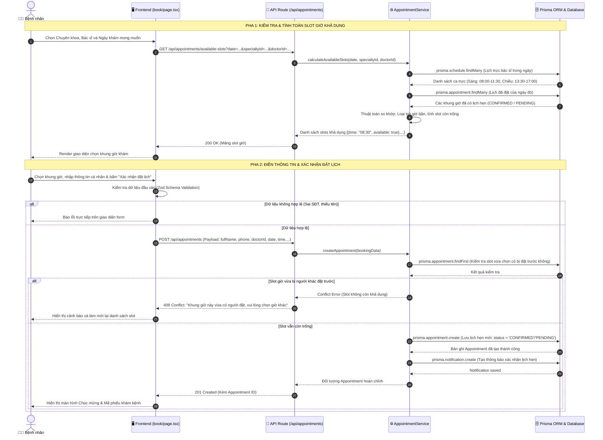
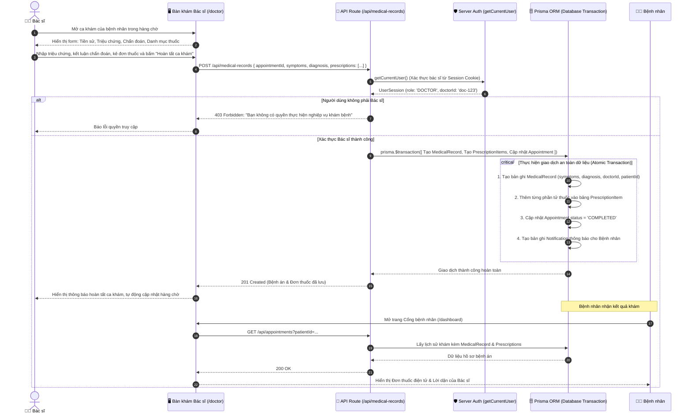
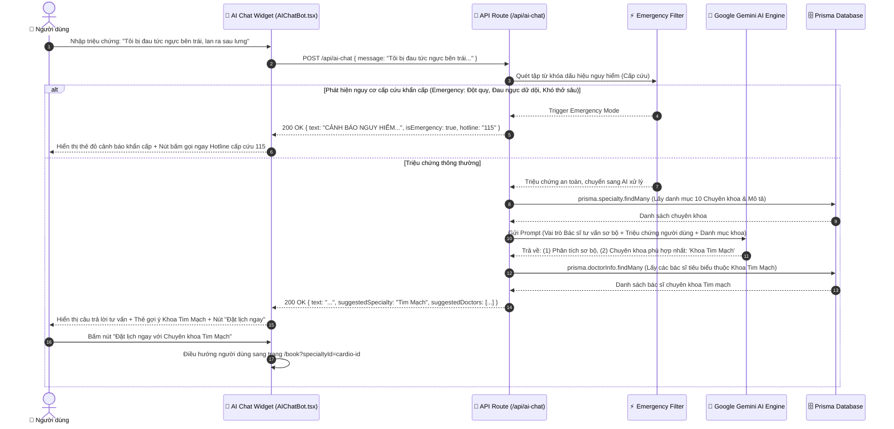
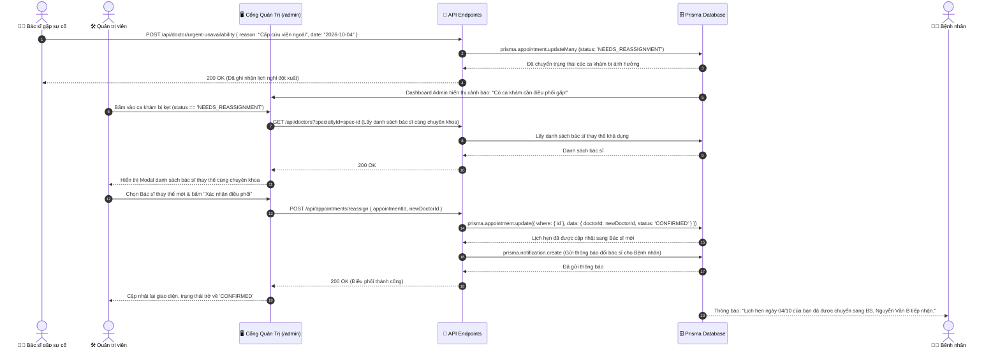

# ⏱️ TÀI LIỆU THIẾT KẾ SƠ ĐỒ TUẦN TỰ (SEQUENCE DIAGRAM SPECIFICATION)
## DỰ ÁN: HỆ THỐNG QUẢN LÝ & ĐẶT LỊCH PHÒNG KHÁM ĐA KHOA CAREPLUS 2026

---

## 📌 TỔNG QUAN VỀ SƠ ĐỒ TUẦN TỰ TRONG ĐỒ ÁN
Sơ đồ tuần tự (Sequence Diagram) là biểu đồ tương tác (Interaction Diagram) quan trọng nhất trong chuẩn UML, mô tả **trật tự giao tiếp theo trục thời gian (từ trên xuống dưới)** giữa các thành phần:
* **Tác nhân (Actor)**: Bệnh nhân, Bác sĩ, Quản trị viên.
* **Giao diện người dùng (Frontend UI / Client View)**: Next.js App Router (React Components, State, Form Hooks).
* **Bộ điều phối API (API Route Handler / Controller)**: Next.js Backend Endpoints (`/api/...`).
* **Tầng nghiệp vụ & Dịch vụ ngoài (Backend Service & External APIs)**: Services, RBAC Auth, Google Gemini AI.
* **Tầng truy cập dữ liệu & Cơ sở dữ liệu (ORM & Database)**: Prisma ORM Client & SQLite (`dev.db`).

Tài liệu này chuẩn hóa **5 kịch bản tuần tự đắt giá nhất** cho báo cáo đồ án tốt nghiệp:
1. **Kịch bản 1**: Đặt lịch khám bệnh trực tuyến & Tính toán slot trống (Online Appointment Booking).
2. **Kịch bản 2**: Đăng nhập, Xác thực danh tính & Cấp quyền phiên làm việc (Authentication & RBAC Session).
3. **Kịch bản 3**: Bác sĩ tiến hành khám bệnh & Kê đơn thuốc điện tử (Clinical Consultation & E-Prescription).
4. **Kịch bản 4**: Trợ lý ảo AI Chatbot tư vấn triệu chứng & Phân luồng y tế (AI Chatbot Consultation & Triage).
5. **Kịch bản 5**: Quản trị viên điều phối lại bác sĩ khi ca trực bị sự cố (Urgent Appointment Reassignment).

---

## 1. SƠ ĐỒ TUẦN TỰ 1: ĐẶT LỊCH KHÁM BỆNH TRỰC TUYẾN (BOOKING ENGINE)
> **Mô tả**: Thể hiện quy trình 2 pha: (1) Tính toán và tải danh sách slot giờ trống trong CSDL; (2) Gửi form đặt lịch, kiểm tra xung đột trùng lịch và lưu phiếu hẹn.



---

## 2. SƠ ĐỒ TUẦN TỰ 2: ĐĂNG NHẬP, XÁC THỰC DANH TÍNH & PHÂN QUYỀN (RBAC)
> **Mô tả**: Thể hiện quy trình bảo mật đăng nhập: kiểm tra tài khoản, xác thực mật khẩu băm bcrypt, cấp cookie HttpOnly và điều hướng theo phân quyền vai trò.

```mermaid
sequenceDiagram
    autonumber
    actor User as 👤 Người dùng
    participant UI as 🖥️ Frontend (login/page.tsx)
    participant API as 🔌 API Route (/api/auth/login)
    participant DB as 🗄️ Prisma ORM & Database
    participant Browser as 🍪 Trình duyệt (Cookie Store)

    User->>UI: Nhập Số điện thoại & Mật khẩu, bấm "Đăng nhập"
    UI->>API: POST /api/auth/login { phone, password }
    API->>DB: prisma.user.findFirst({ where: { phone } })
    DB-->>API: Trả về bản ghi User (id, passwordHash, role, fullName)
    
    alt Không tìm thấy tài khoản
        API-->>UI: 401 Unauthorized: "Số điện thoại không tồn tại trong hệ thống"
        UI-->>User: Hiển thị thông báo lỗi màu đỏ
    else Tìm thấy tài khoản
        API->>API: Gọi hàm bcrypt.compare(password, user.passwordHash)
        
        alt Mật khẩu không chính xác
            API-->>UI: 401 Unauthorized: "Mật khẩu không chính xác"
            UI-->>User: Hiển thị thông báo lỗi
        else Mật khẩu khớp hoàn toàn
            API->>API: Đóng gói User Session Token { id, fullName, role, email }
            API->>Browser: Set-Cookie: phongkham_session_user=...; HttpOnly; Path=/; SameSite=Lax
            API-->>UI: 200 OK { success: true, user: { id, fullName, role } }
            
            Note over UI, User: Điều hướng trang theo Phân quyền (Role-based Navigation)
            alt role === 'ADMIN'
                UI->>UI: router.push('/admin')
            else role === 'DOCTOR'
                UI->>UI: router.push('/doctor')
            else role === 'PATIENT'
                UI->>UI: router.push('/dashboard')
            end
            UI-->>User: Hiển thị Cổng thông tin tương ứng với vai trò
        end
    end
```

---

## 3. SƠ ĐỒ TUẦN TỰ 3: BÁC SĨ KHÁM BỆNH & KÊ ĐƠN THUỐC ĐIỆN TỬ
> **Mô tả**: Thể hiện giao dịch y tế hoàn chỉnh: Bác sĩ nhập triệu chứng, chẩn đoán, kê danh mục thuốc và hệ thống thực hiện Database Transaction để bảo toàn dữ liệu.



---

## 4. SƠ ĐỒ TUẦN TỰ 4: TRỢ LÝ ẢO AI CHATBOT TƯ VẤN Y TẾ (AI TRIAGE)
> **Mô tả**: Thể hiện quy trình tích hợp Trí tuệ nhân tạo (Google Gemini) xử lý ngôn ngữ tự nhiên, phân tích triệu chứng y tế và điều hướng khám bệnh.



---

## 5. SƠ ĐỒ TUẦN TỰ 5: ĐIỀU PHỐI LẠI BÁC SĨ KHI CA TRỰC BIẾN ĐỘNG (REASSIGNMENT)
> **Mô tả**: Thể hiện cơ chế phục hồi hệ thống khi Bác sĩ báo bận đột xuất, chuyển lịch hẹn sang trạng thái `NEEDS_REASSIGNMENT` và Quản trị viên can thiệp điều phối.



---

## 6. HƯỚNG DẪN TRÌNH BÀY TRONG BÁO CÁO ĐỒ ÁN
* **Vị trí đề xuất trong Báo cáo**:
  * Đặt tại **Chương 4: Thiết kế chi tiết hệ thống ➔ Mục 4.2: Biểu đồ tuần tự cho các ca sử dụng chính**.
* **Cách thức xuất ảnh chất lượng cao**:
  * Sao chép mã nguồn `mermaid` của từng sơ đồ vào công cụ [Mermaid Live Editor](https://mermaid.live) hoặc [Draw.io](https://app.diagrams.net).
  * Xuất ảnh định dạng PNG (độ phân giải cao) hoặc vector SVG để chèn vào tài liệu báo cáo Word/PDF mà không bị vỡ nét.
