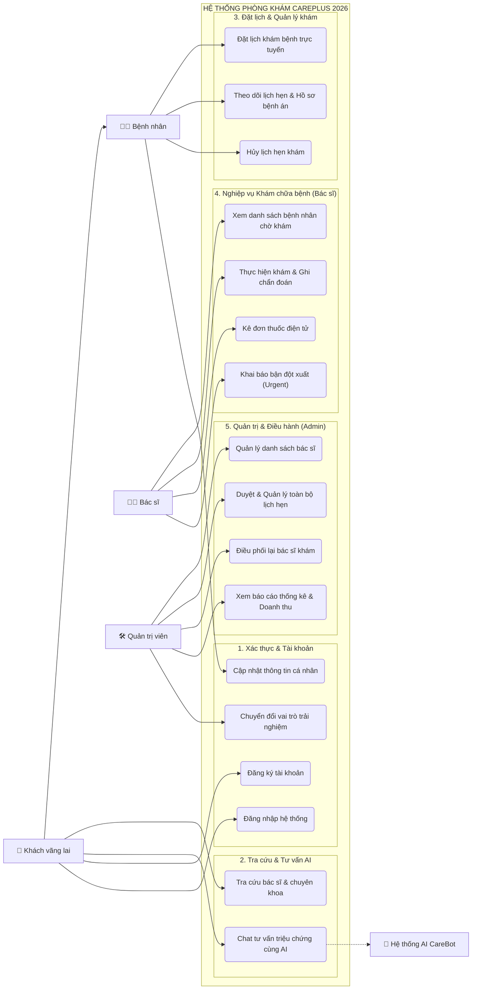
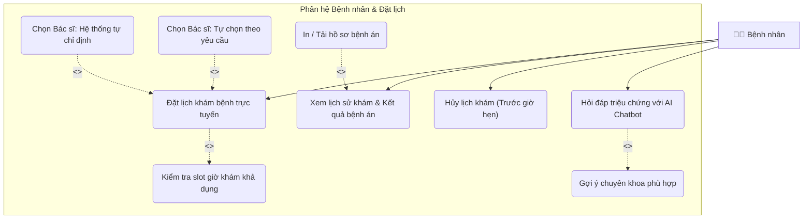
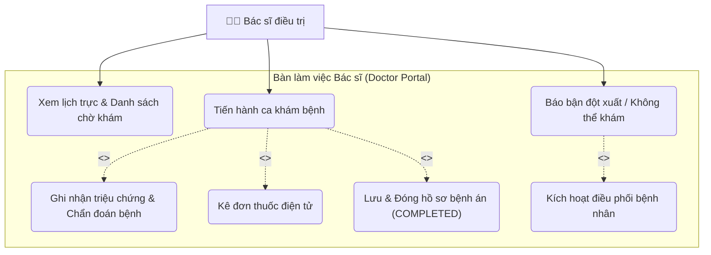
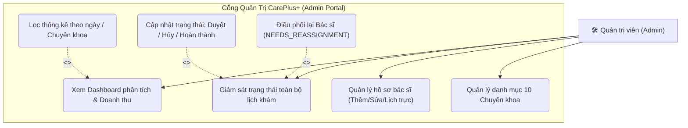

# 📐 TÀI LIỆU THIẾT KẾ SƠ ĐỒ USE CASE (USE CASE SPECIFICATION)
## DỰ ÁN: HỆ THỐNG QUẢN LÝ & ĐẶT LỊCH PHÒNG KHÁM ĐA KHOA CAREPLUS 2026

---

## 1. XÁC ĐỊNH CÁC TÁC NHÂN (ACTORS)

| STT | Tác nhân (Actor) | Loại tác nhân | Mô tả vai trò & Trách nhiệm |
| :---: | :--- | :--- | :--- |
| **1** | **Khách vãng lai / Bệnh nhân chưa đăng nhập (Guest)** | Primary Actor | Người dùng truy cập trang web để tìm hiểu thông tin phòng khám, tra cứu đội ngũ bác sĩ, 10 chuyên khoa y tế, trò chuyện cùng AI Chatbot và có thể đặt lịch khám nhanh. |
| **2** | **Bệnh nhân có tài khoản (Patient)** | Primary Actor | Người bệnh đã đăng ký tài khoản qua số điện thoại; có thể đặt lịch khám, theo dõi tiến trình lịch hẹn, tra cứu lịch sử bệnh án, cập nhật thông tin cá nhân. |
| **3** | **Bác sĩ (Doctor)** | Primary Actor | Nhân viên y tế phụ trách chuyên môn; theo dõi danh sách bệnh nhân đặt khám theo ca trực, tiến hành khám bệnh, nhập chẩn đoán lâm sàng, kê đơn thuốc điện tử, khai báo bận đột xuất. |
| **4** | **Quản trị viên (Admin)** | Primary Actor | Người phụ trách điều hành hệ thống phòng khám; quản lý danh mục bác sĩ, tài khoản, chuyên khoa, duyệt lịch khám, điều phối lại bác sĩ khi có biến động ca trực, theo dõi báo cáo doanh thu & KPIs. |
| **5** | **Hệ thống AI Chatbot (AI Assistant System)** | Secondary / Supporting Actor | Hệ thống trí tuệ nhân tạo (Google Gemini tích hợp) đóng vai trò trợ lý y tế ảo; tiếp nhận câu hỏi triệu chứng, phân tích sơ bộ và gợi ý chuyên khoa / bác sĩ phù hợp. |

---

## 2. SƠ ĐỒ USE CASE TỔNG QUAN HỆ THỐNG (OVERALL SYSTEM USE CASE)

---

## 3. SƠ ĐỒ USE CASE PHÂN RÃ THEO TỪNG PHÂN HỆ

### 3.1. Phân hệ Bệnh nhân (Patient Subsystem)
Mô tả chi tiết các tương tác của người bệnh, bao gồm các mối quan hệ `<<include>>` và `<<extend>>`.

---

### 3.2. Phân hệ Bác sĩ (Doctor Subsystem)
Mô tả toàn bộ quy trình làm việc trong ca trực của Bác sĩ.

---

### 3.3. Phân hệ Quản trị viên (Admin Subsystem)
Mô tả các chức năng điều hành phòng khám, xử lý ca kẹt và giám sát tài chính.

---

## 4. BẢNG ĐẶC TẢ CHI TIẾT USE CASE (USE CASE SPECIFICATIONS)
*(Đây là phần bắt buộc trong Báo cáo Đồ án tốt nghiệp / Đồ án môn học để chứng minh tính hoàn thiện của thiết kế)*

### 📝 Đặc tả Use Case 1: ĐẶT LỊCH KHÁM BỆNH TRỰC TUYẾN (UC-01)
* **Mã Use Case**: `UC_BOOK_APPOINTMENT`
* **Tên Use Case**: Đặt lịch khám bệnh trực tuyến
* **Tác nhân chính**: Bệnh nhân (Patient / Guest)
* **Mô tả tóm tắt**: Bệnh nhân lựa chọn chuyên khoa, bác sĩ, ngày giờ khám và cung cấp thông tin cá nhân để tạo lịch hẹn khám bệnh tại phòng khám.
* **Tiền điều kiện (Pre-conditions)**:
  * Hệ thống hoạt động bình thường, các chuyên khoa và lịch bác sĩ đã được cấu hình trong CSDL.
* **Hậu điều kiện (Post-conditions)**:
  * Lịch hẹn mới được ghi vào CSDL với trạng thái `PENDING` hoặc `CONFIRMED`.
  * Slot giờ đó được trừ đi hoặc đánh dấu đã bận đối với bác sĩ tương ứng.
  * Hiển thị thông báo đặt lịch thành công và mã phiếu hẹn cho bệnh nhân.
* **Luồng sự kiện chính (Basic Flow)**:
  1. Bệnh nhân truy cập trang Đặt lịch khám (`/book`).
  2. Bệnh nhân chọn **Chuyên khoa** cần khám từ danh mục 10 chuyên khoa.
  3. Bệnh nhân chọn hình thức đặt:
     - *Cách A*: Tự chọn bác sĩ từ danh sách.
     - *Cách B*: Để hệ thống tự động phân bổ bác sĩ khả dụng tốt nhất.
  4. Bệnh nhân chọn **Ngày khám** mong muốn.
  5. Hệ thống tự động tính toán và hiển thị các **Khung giờ (Slots) còn trống**.
  6. Bệnh nhân chọn khung giờ phù hợp.
  7. Bệnh nhân điền thông tin: Họ tên, Số điện thoại, Email, Mô tả triệu chứng ban đầu.
  8. Bệnh nhân kiểm tra lại tóm tắt phiếu đặt và bấm **"Xác nhận đặt lịch"**.
  9. Hệ thống lưu lịch hẹn vào CSDL và gửi thông báo xác nhận thành công.
* **Luồng sự kiện rẽ nhánh / Ngoại lệ (Alternative / Exception Flows)**:
  * *Ngoại lệ 4a (Ngày trong quá khứ)*: Hệ thống báo lỗi và khóa không cho chọn ngày đã qua.
  * *Ngoại lệ 5a (Hết slot khám)*: Khung giờ đã kín lịch sẽ bị vô hiệu hóa (disabled), hiển thị nhãn "Hết chỗ".
  * *Ngoại lệ 7a (Sai định dạng SĐT)*: Hệ thống kích hoạt Zod schema báo lỗi định dạng số điện thoại Việt Nam (10 chữ số).

---

### 📝 Đặc tả Use Case 2: KHÁM BỆNH & KÊ ĐƠN THUỐC ĐIỆN TỬ (UC-02)
* **Mã Use Case**: `UC_DOCTOR_CONSULTATION`
* **Tên Use Case**: Khám bệnh và Kê đơn thuốc điện tử
* **Tác nhân chính**: Bác sĩ (Doctor)
* **Tiền điều kiện (Pre-conditions)**:
  * Bác sĩ đã đăng nhập hệ thống với tài khoản có quyền `DOCTOR`.
  * Có lịch hẹn của bệnh nhân trong ca trực ở trạng thái `CONFIRMED`.
* **Hậu điều kiện (Post-conditions)**:
  * Hồ sơ bệnh án điện tử (`MedicalRecord`) được tạo và liên kết với lịch hẹn.
  * Danh sách đơn thuốc (`PrescriptionItem`) được lưu trữ.
  * Trạng thái lịch hẹn chuyển sang `COMPLETED`.
* **Luồng sự kiện chính (Basic Flow)**:
  1. Bác sĩ mở trang Bàn làm việc Bác sĩ (`/doctor`).
  2. Bác sĩ chọn ca khám của bệnh nhân cần khám trong danh sách chờ.
  3. Bác sĩ bấm nút **"Tiến hành khám bệnh"**.
  4. Bác sĩ nhập thông tin: Triệu chứng lâm sàng, Kết luận chẩn đoán bệnh, Lời dặn dò bác sĩ.
  5. Bác sĩ thêm danh mục thuốc cần kê: Tên thuốc, Hàm lượng (mg/ml), Cách dùng (uống/bôi/tiêm), Số ngày dùng.
  6. Bác sĩ kiểm tra lại thông tin đơn thuốc và bấm **"Hoàn tất ca khám & Kê đơn"**.
  7. Hệ thống cập nhật trạng thái lịch hẹn sang `COMPLETED`, lưu bệnh án và gửi thông báo hoàn tất.

---

### 📝 Đặc tả Use Case 3: ĐIỀU PHỐI LẠI BÁC SĨ KHÁM (UC-03)
* **Mã Use Case**: `UC_ADMIN_REASSIGN_DOCTOR`
* **Tên Use Case**: Điều phối lại Bác sĩ khi có sự cố ca trực
* **Tác nhân chính**: Quản trị viên (Admin)
* **Tác nhân phụ**: Bác sĩ báo bận
* **Mô tả tóm tắt**: Khi bác sĩ có ca cấp cứu hoặc bận đột xuất, các lịch hẹn bị ảnh hưởng sẽ chuyển trạng thái `NEEDS_REASSIGNMENT`. Admin thực hiện gán bệnh nhân sang bác sĩ khác cùng chuyên khoa mà không làm hủy lịch của bệnh nhân.
* **Luồng sự kiện chính (Basic Flow)**:
  1. Bác sĩ gửi thông báo bận đột xuất trên hệ thống.
  2. Hệ thống tự động gắn cờ các lịch hẹn bị ảnh hưởng thành `NEEDS_REASSIGNMENT`.
  3. Quản trị viên nhận cảnh báo khẩn trên trang Dashboard Admin (`/admin`).
  4. Quản trị viên mở modal **"Điều phối bác sĩ thay thế"**.
  5. Hệ thống lọc danh sách các bác sĩ cùng chuyên khoa còn trống giờ vào khung giờ đó.
  6. Quản trị viên chọn bác sĩ mới và xác nhận chuyển giao ca khám.
  7. Hệ thống cập nhật `doctorId` mới cho lịch hẹn, đưa trạng thái trở lại `CONFIRMED`.
